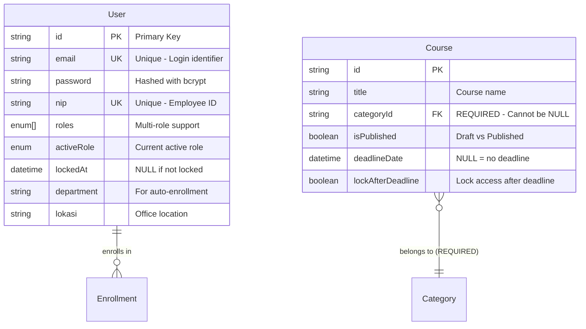
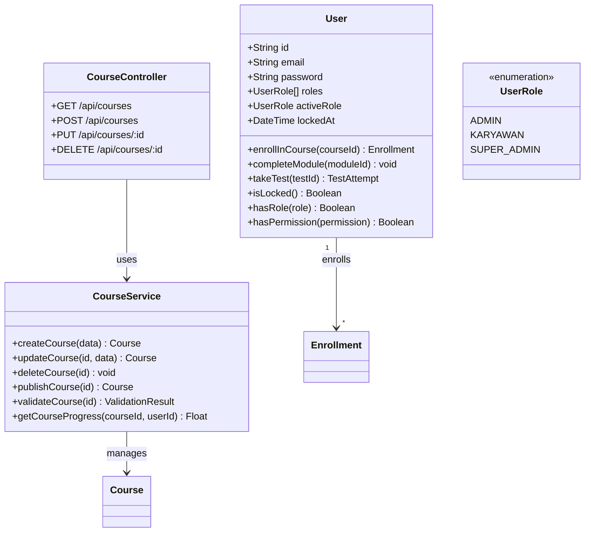
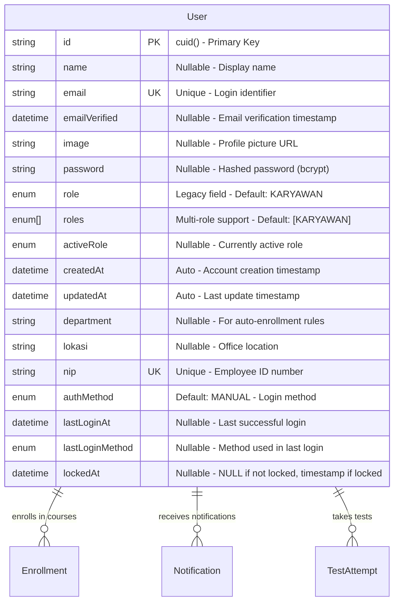
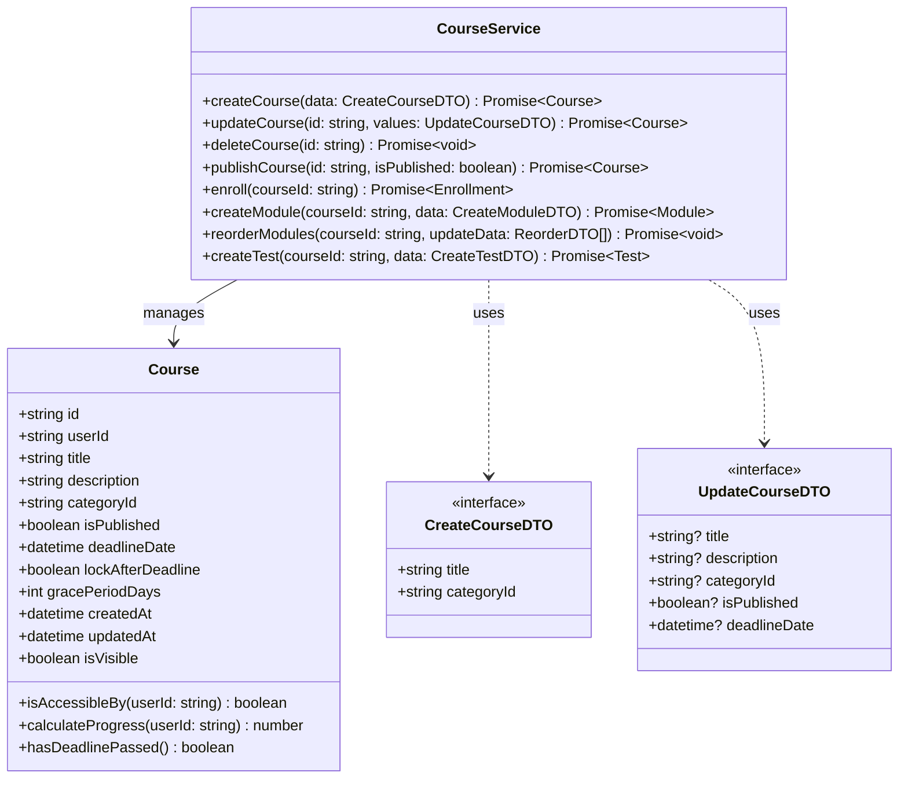
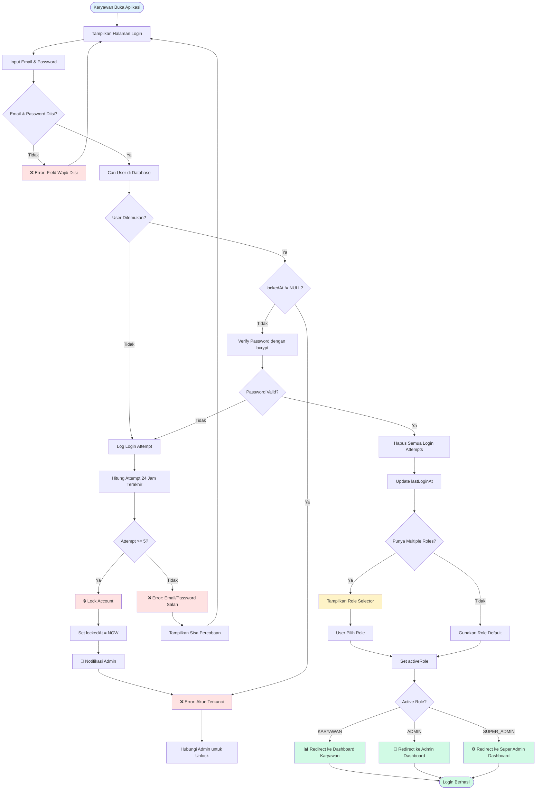
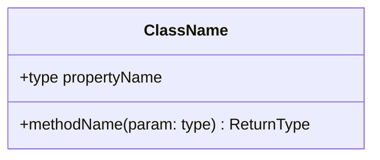
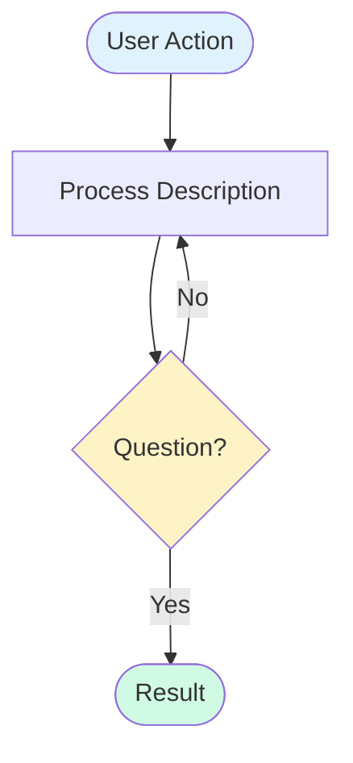
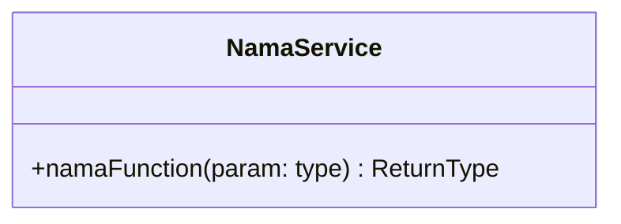
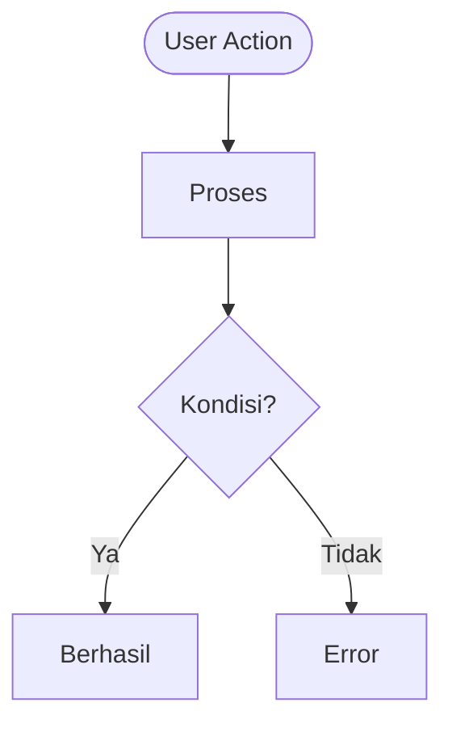

# 📘 Panduan Lengkap Dokumentasi Sistem E-Learning BNI Finance

**Dokumen:** Panduan Pembuatan ERD, Class Diagram, dan Flowchart  
**Versi:** 2.0  
**Tanggal:** 5 Mei 2026  
**Tujuan:** Memberikan panduan DETAIL, JELAS, SEMPURNA, dan RAPI untuk membuat dokumentasi FSD/BRD

> **PENTING:** Panduan ini menjelaskan **APA YANG HARUS DIAMBIL** dari sistem untuk membuat setiap diagram. Ikuti langkah demi langkah untuk hasil yang sempurna.

---

## 📑 Daftar Isi

1. [Panduan ERD (Entity Relationship Diagram)](#1-panduan-erd)
2. [Panduan Class Diagram](#2-panduan-class-diagram)
3. [Panduan Flowchart](#3-panduan-flowchart)
4. [Checklist Kelengkapan](#4-checklist-kelengkapan)
5. [Contoh Lengkap](#5-contoh-lengkap)

---

## 1. Panduan ERD (Entity Relationship Diagram)

### 🎯 Tujuan ERD
Menggambarkan **struktur database** dan **relasi antar tabel** dalam sistem.

### 📋 Yang Harus Diambil dari Sistem

#### A. Dari File `prisma/schema.prisma`

**1. Semua Model (Tabel)**
```prisma
model User {
  id String @id @default(cuid())
  email String @unique
  // ... fields lainnya
}
```

**Ambil:**
- ✅ Nama model (User, Course, Module, dll)
- ✅ Semua field dengan tipe data
- ✅ Primary Key (PK) - field dengan `@id`
- ✅ Unique Key (UK) - field dengan `@unique`
- ✅ Foreign Key (FK) - field yang berakhiran `Id`
- ✅ Enum types
- ✅ Default values
- ✅ Constraints (`@default`, `@unique`, dll)

**2. Relasi Antar Model**
```prisma
User ||--o{ Enrollment : "enrolls"
Course }o--|| Category : "belongs to"
```

**Ambil:**
- ✅ One-to-Many (1:N) - `||--o{`
- ✅ Many-to-One (N:1) - `}o--||`
- ✅ One-to-One (1:1) - `||--||`
- ✅ Many-to-Many (N:M) - `}o--o{`
- ✅ Label relasi (contoh: "enrolls", "belongs to")

**3. Composite Unique Keys**
```prisma
@@unique([userId, courseId])
```

**Ambil:**
- ✅ Kombinasi field yang harus unik
- ✅ Constraint name (jika ada)

**4. Indexes**
```prisma
@@index([email])
@@index([userId, courseId])
```

**Ambil:**
- ✅ Field yang di-index
- ✅ Composite index

#### B. Dari Business Logic

**5. Cascade Rules**
```prisma
onDelete: Cascade
onDelete: SetNull
```

**Ambil:**
- ✅ Apa yang terjadi saat parent dihapus
- ✅ Field yang nullable vs required

### 📊 Struktur ERD yang Sempurna



### ✅ Checklist ERD Lengkap

- [ ] **Semua tabel** dari schema.prisma sudah digambar
- [ ] **Semua field** dengan tipe data sudah ada
- [ ] **PK, UK, FK** sudah ditandai dengan jelas
- [ ] **Relasi** sudah benar (1:1, 1:N, N:M)
- [ ] **Cardinality** sudah tepat (||, }o, o{)
- [ ] **Label relasi** sudah deskriptif
- [ ] **Constraint** (REQUIRED, UNIQUE) sudah dijelaskan
- [ ] **Enum values** sudah didokumentasikan
- [ ] **Komentar** untuk field penting sudah ada

---

## 2. Panduan Class Diagram

### 🎯 Tujuan Class Diagram
Menggambarkan **struktur kode**, **class**, **method**, dan **relasi antar class**.

### 📋 Yang Harus Diambil dari Sistem

#### A. Dari Models/Entities (`src/generated/client/`)

**1. Entity Classes**
```typescript
class User {
  +String id
  +String email
  +String password
  // ... properties
}
```

**Ambil dari Prisma Model:**
- ✅ Semua properties (sama dengan ERD)
- ✅ Tipe data TypeScript
- ✅ Visibility (+public, -private, #protected)

**2. Methods untuk Entity**
```typescript
class User {
  // Properties...
  
  // Methods
  +enrollInCourse(courseId: string): Enrollment
  +completeModule(moduleId: string): void
  +takeTest(testId: string): TestAttempt
  +isLocked(): boolean
  +hasRole(role: UserRole): boolean
  +hasPermission(permission: string): boolean
}
```

**Ambil dari:**
- ✅ Business logic di `src/actions/`
- ✅ Helper functions di `src/lib/`
- ✅ Utility functions yang terkait entity

#### B. Dari Service Layer (`src/actions/`, `src/lib/`)

**3. Service Classes**
```typescript
class CourseService {
  +createCourse(data: CreateCourseDTO): Promise<Course>
  +updateCourse(id: string, data: UpdateCourseDTO): Promise<Course>
  +deleteCourse(id: string): Promise<void>
  +publishCourse(id: string): Promise<Course>
  +validateCourse(id: string): ValidationResult
  +getCourseProgress(courseId: string, userId: string): Promise<number>
}
```

**Ambil dari file:**
- ✅ `src/actions/course.ts` → CourseService
- ✅ `src/actions/enrollment.ts` → EnrollmentService
- ✅ `src/actions/module.ts` → ModuleService
- ✅ `src/actions/test.ts` → TestService
- ✅ `src/actions/user-progress.ts` → ProgressService
- ✅ `src/actions/notifications.ts` → NotificationService

**Struktur Service:**
```typescript
// Dari src/actions/course.ts
export async function createCourse(data) { }
export async function updateCourse(id, values) { }
export async function deleteCourse(id) { }
export async function publishCourse(id, isPublished) { }

// Menjadi Class Diagram:
class CourseService {
  +createCourse(data): Course
  +updateCourse(id, values): Course
  +deleteCourse(id): void
  +publishCourse(id, isPublished): Course
}
```

#### C. Dari API Routes (`src/app/api/`)

**4. Controller Classes**
```typescript
class CourseController {
  +GET /api/courses
  +GET /api/courses/:id
  +POST /api/courses
  +PUT /api/courses/:id
  +DELETE /api/courses/:id
  +POST /api/courses/:id/publish
}
```

**Ambil dari:**
- ✅ `src/app/api/courses/` → CourseController
- ✅ `src/app/api/enrollments/` → EnrollmentController
- ✅ `src/app/api/users/` → UserController
- ✅ `src/app/api/notifications/` → NotificationController

#### D. Dari Components (`src/components/`, `src/app/`)

**5. UI Component Classes (Optional)**
```typescript
class CourseCard {
  +props: Course
  +render(): JSX.Element
  +handleClick(): void
}
```

**Ambil dari:**
- ✅ `src/components/` - Shared components
- ✅ `src/app/(karyawan)/` - Karyawan pages
- ✅ `src/app/admin/` - Admin pages

#### E. Enums & Types

**6. Enum Classes**
```typescript
class UserRole {
  <<enumeration>>
  ADMIN
  KARYAWAN
  SUPER_ADMIN
}
```

**Ambil dari:**
- ✅ `prisma/schema.prisma` - Semua enum
- ✅ `src/types/` - Custom types

### 📊 Struktur Class Diagram yang Sempurna



### ✅ Checklist Class Diagram Lengkap

- [ ] **Entity classes** dari semua Prisma models
- [ ] **Properties** dengan tipe data TypeScript
- [ ] **Methods** dari business logic
- [ ] **Service classes** dari src/actions/
- [ ] **Controller classes** dari src/app/api/
- [ ] **Enum classes** dari schema.prisma
- [ ] **Relationships** antar class
- [ ] **Visibility** (+public, -private) sudah benar
- [ ] **Return types** sudah jelas
- [ ] **Parameter types** sudah lengkap

---

## 3. Panduan Flowchart

### 🎯 Tujuan Flowchart
Menggambarkan **alur proses bisnis** dan **user journey** dalam sistem.

### 📋 Yang Harus Diambil dari Sistem

#### A. User Journey - Karyawan

**1. Alur Login**

**Ambil dari:**
- ✅ `src/app/auth/login/page.tsx` - UI login
- ✅ `src/auth.ts` - NextAuth configuration
- ✅ `src/actions/login.ts` - Login logic
- ✅ `prisma/schema.prisma` - LoginAttempt model

**Proses yang harus digambar:**
```
1. User buka halaman login
2. Input email & password
3. Validasi credentials
   - Valid? → Check account locked?
     - Locked? → Show error
     - Not locked? → Reset login attempts → Select role → Dashboard
   - Invalid? → Increment login attempt
     - Attempt >= 5? → Lock account → Notify admin
     - Attempt < 5? → Show error → Back to login
```

**2. Alur Enrollment**

**Ambil dari:**
- ✅ `src/app/(karyawan)/courses/page.tsx` - Katalog
- ✅ `src/app/(karyawan)/courses/[courseId]/page.tsx` - Detail kursus
- ✅ `src/actions/course.ts` - Function `enroll()`
- ✅ `prisma/schema.prisma` - Enrollment model

**Proses yang harus digambar:**
```
1. Browse katalog
2. Filter/Search kursus
3. Pilih kursus
4. Lihat detail
5. Check status enrollment
   - Belum daftar? → Show button daftar
   - Pending? → Show status menunggu
   - In Progress? → Show akses kursus
   - Completed? → Show sertifikat
6. Klik daftar
7. Konfirmasi
8. Create enrollment (PENDING)
9. Notifikasi ke admin
10. Tunggu approval
```

**3. Alur Mengerjakan Kursus**

**Ambil dari:**
- ✅ `src/app/(karyawan)/courses/[courseId]/modules/[moduleId]/page.tsx`
- ✅ `src/components/media/VideoPlayer.tsx`
- ✅ `src/components/media/PDFViewer.tsx` (jika ada)
- ✅ `src/actions/user-progress.ts`
- ✅ `src/app/api/progress/video/save/route.ts`
- ✅ `src/app/api/progress/pdf/save/route.ts`

**Proses yang harus digambar:**
```
1. Akses kursus
2. Check PRE-TEST?
   - Ada? → Kerjakan PRE-TEST → Monitor cheating → Submit
   - Tidak? → Langsung ke modul
3. Lihat daftar modul
4. Pilih modul
5. Check tipe modul
   - Video? → Play video → Track progress (≥95%) → Complete
   - PDF? → Read PDF → Track progress (≥90%) → Complete
6. Mark module complete
7. Check semua modul selesai?
   - Tidak? → Back to daftar modul
   - Ya? → Check POST-TEST?
8. POST-TEST?
   - Ada? → Kerjakan POST-TEST → Monitor cheating → Submit → Check score
     - Pass? → Course complete
     - Fail? → Check attempts → Retry or Fail
   - Tidak? → Course complete
9. Generate sertifikat
10. Notifikasi selesai
```

**4. Alur Test (PRE/POST)**

**Ambil dari:**
- ✅ `src/app/(karyawan)/courses/[courseId]/tests/[testId]/page.tsx`
- ✅ `src/app/api/courses/[courseId]/tests/[testId]/start/route.ts`
- ✅ `src/app/api/courses/[courseId]/tests/[testId]/submit/route.ts`
- ✅ `src/app/api/courses/[courseId]/tests/[testId]/violation/route.ts`
- ✅ `src/actions/test.ts`

**Proses yang harus digambar:**
```
1. Start test
2. Load questions
3. Randomize (if enabled)
4. Answer questions
5. Monitoring system (cheating detection)
   - Tab switch? → Log violation
   - Window blur? → Log violation
   - Copy/paste? → Log violation
   - DevTools? → Log violation
6. Check violation count
   - > Limit? → Flag cheating → Force submit → Fail
   - <= Limit? → Allow continue
7. Submit test
8. Calculate score
9. Check score >= passing score?
   - Yes? → Pass
   - No? → Check attempts < max?
     - Yes? → Allow retry
     - No? → Fail
```

#### B. User Journey - Admin

**5. Alur Membuat Kursus**

**Ambil dari:**
- ✅ `src/app/admin/courses/create/page.tsx` - Form create
- ✅ `src/app/admin/courses/[courseId]/page.tsx` - Course wizard
- ✅ `src/components/admin/CourseWizard.tsx` - Wizard component
- ✅ `src/actions/course.ts` - CRUD functions

**Proses yang harus digambar:**
```
Step 1: Identitas
1. Input judul
2. Input deskripsi
3. Pilih kategori (WAJIB)
4. Validasi

Step 2: Kurikulum
5. Tambah modul
   - Video? → Upload video → Set details
   - PDF? → Upload PDF → Set details
6. Set urutan modul
7. Tambah test
   - PRE-TEST? → Create test → Add questions
   - POST-TEST? → Create test → Add questions
8. Set test config (duration, passing score, max attempts, randomize)

Step 3: Pengaturan
9. Set deadline
   - Fixed date? → Set tanggal
   - Duration? → Set durasi hari
10. Set lock after deadline
11. Set grace period
12. Set visibility (public/private)

Step 4: Publikasi
13. Validasi kursus
    - Check judul? ✓
    - Check deskripsi? ✓
    - Check kategori? ✓
    - Check modul published? ✓
    - Check POST-TEST valid? ✓
14. Konfirmasi publish
15. Publish kursus
```

**6. Alur Approval Enrollment**

**Ambil dari:**
- ✅ `src/app/admin/enrollments/page.tsx`
- ✅ `src/app/admin/enrollments/_components/EnrollmentsClient.tsx`
- ✅ `src/app/admin/enrollments/actions.ts`

**Proses yang harus digambar:**
```
1. Admin dapat notifikasi enrollment baru
2. Buka halaman enrollment
3. Filter: PENDING
4. Lihat daftar pending
5. Pilih enrollment
6. Lihat detail (info karyawan + info kursus)
7. Keputusan admin
   - Approve?
     a. Set deadline (use default or custom)
     b. Update status: IN_PROGRESS
     c. Notifikasi karyawan (approved)
     d. Log approval action
   - Reject?
     a. Input alasan penolakan (min 10 karakter)
     b. Update status: REJECTED
     c. Notifikasi karyawan (rejected)
     d. Log rejection action
   - Skip? → Back to list
```

#### C. Proses Bisnis Sistem

**7. Deadline Monitoring & Reminder**

**Ambil dari:**
- ✅ `src/app/api/cron/deadline-monitoring/route.ts`
- ✅ `src/app/api/cron/reminders/route.ts`
- ✅ `prisma/schema.prisma` - Enrollment fields (remindedAt7d, remindedAt3d, remindedAt1d, escalatedAt)

**Proses yang harus digambar:**
```
1. Cron job run (setiap hari)
2. Fetch enrollments (status: IN_PROGRESS)
3. Loop each enrollment
4. Calculate days left to deadline
5. Check days left
   - 7 days? → Check already reminded 7d?
     - No? → Send reminder → Update remindedAt7d
     - Yes? → Skip
   - 3 days? → Check already reminded 3d?
     - No? → Send reminder → Update remindedAt3d
     - Yes? → Skip
   - 1 day? → Check already reminded 1d?
     - No? → Send reminder → Update remindedAt1d
     - Yes? → Skip
   - Overdue? → Check already escalated?
     - No? → Escalate to head → Update escalatedAt
     - Yes? → Check lock after deadline?
       - Yes? → Lock course access → Notify karyawan
       - No? → Skip
6. Next enrollment
7. Log job complete
```

**8. Auto Enrollment**

**Ambil dari:**
- ✅ `src/app/api/cron/auto-enroll/route.ts`
- ✅ `prisma/schema.prisma` - AutoEnrollmentRule model

**Proses yang harus digambar:**
```
1. Cron job run (setiap hari)
2. Fetch auto enrollment rules (isActive: true)
3. Loop each rule
4. Get course info
5. Get department from rule
6. Fetch users by department
7. Loop each user
8. Check already enrolled?
   - Yes? → Skip
   - No? → Create enrollment
     a. Check bypass deadline?
        - Yes? → Status: IN_PROGRESS → Set deadline → Notify user
        - No? → Status: PENDING → Notify admin
9. Next user
10. Next rule
11. Log job complete
```

### 📊 Struktur Flowchart yang Sempurna


**Elemen Flowchart:**
- 🟦 **Start/End** - Rounded rectangle `([Text])`
- ⬜ **Process** - Rectangle `[Text]`
- 🔶 **Decision** - Diamond `{Question?}`
- ➡️ **Flow** - Arrow `-->`
- 🏷️ **Label** - Text on arrow `-->|Label|`
- 🎨 **Style** - Color coding

**Color Coding:**
- 🔵 Blue (`#e0f2fe`) - Start/Input
- 🟢 Green (`#d1fae5`) - Success/Complete
- 🟡 Yellow (`#fef3c7`) - Warning/Pending
- 🔴 Red (`#fee2e2`) - Error/Failed
- ⚪ White - Normal process

### ✅ Checklist Flowchart Lengkap

- [ ] **Start node** jelas (user action)
- [ ] **End node** jelas (result)
- [ ] **Semua decision** punya 2+ output (Yes/No)
- [ ] **Semua path** menuju end node
- [ ] **No dead end** (semua node terkoneksi)
- [ ] **Label** pada arrow jelas
- [ ] **Process description** singkat & jelas
- [ ] **Color coding** konsisten
- [ ] **Happy path** (success flow) jelas
- [ ] **Error handling** sudah digambar
- [ ] **Alternative path** sudah ada
- [ ] **Loop** (jika ada) jelas

---

## 4. Checklist Kelengkapan

### ✅ ERD Checklist

| No | Item | Status | File Sumber |
|----|------|--------|-------------|
| 1 | Semua model dari schema.prisma | ⬜ | `prisma/schema.prisma` |
| 2 | Semua field dengan tipe data | ⬜ | `prisma/schema.prisma` |
| 3 | Primary Keys (PK) | ⬜ | `@id` |
| 4 | Unique Keys (UK) | ⬜ | `@unique` |
| 5 | Foreign Keys (FK) | ⬜ | Field ending with `Id` |
| 6 | Relasi antar tabel | ⬜ | Relations in schema |
| 7 | Cardinality (1:1, 1:N, N:M) | ⬜ | Relation types |
| 8 | Composite unique keys | ⬜ | `@@unique([])` |
| 9 | Indexes | ⬜ | `@@index([])` |
| 10 | Enum types | ⬜ | `enum` definitions |
| 11 | Cascade rules | ⬜ | `onDelete:` |
| 12 | Required vs Optional | ⬜ | `?` in field type |
| 13 | Default values | ⬜ | `@default()` |
| 14 | Komentar field penting | ⬜ | Manual |

### ✅ Class Diagram Checklist

| No | Item | Status | File Sumber |
|----|------|--------|-------------|
| 1 | Entity classes | ⬜ | `prisma/schema.prisma` |
| 2 | Properties dengan tipe | ⬜ | Model fields |
| 3 | Methods dari business logic | ⬜ | `src/actions/*.ts` |
| 4 | Service classes | ⬜ | `src/actions/*.ts` |
| 5 | Controller classes | ⬜ | `src/app/api/**/route.ts` |
| 6 | Enum classes | ⬜ | `enum` in schema |
| 7 | Relationships antar class | ⬜ | Dependencies |
| 8 | Visibility (+, -, #) | ⬜ | Access modifiers |
| 9 | Return types | ⬜ | Function signatures |
| 10 | Parameter types | ⬜ | Function parameters |
| 11 | Interface/Abstract | ⬜ | TypeScript interfaces |
| 12 | Design patterns | ⬜ | Code structure |

### ✅ Flowchart Checklist

| No | Item | Status | File Sumber |
|----|------|--------|-------------|
| 1 | Login flow | ⬜ | `src/app/auth/login/`, `src/auth.ts` |
| 2 | Enrollment flow | ⬜ | `src/app/(karyawan)/courses/` |
| 3 | Module learning flow | ⬜ | `src/app/(karyawan)/courses/[courseId]/modules/` |
| 4 | Test flow (PRE/POST) | ⬜ | `src/app/(karyawan)/courses/[courseId]/tests/` |
| 5 | Course creation flow | ⬜ | `src/app/admin/courses/create/` |
| 6 | Approval flow | ⬜ | `src/app/admin/enrollments/` |
| 7 | Deadline monitoring | ⬜ | `src/app/api/cron/deadline-monitoring/` |
| 8 | Auto enrollment | ⬜ | `src/app/api/cron/auto-enroll/` |
| 9 | Start/End nodes | ⬜ | Manual |
| 10 | Decision nodes | ⬜ | Manual |
| 11 | Process nodes | ⬜ | Manual |
| 12 | Color coding | ⬜ | Manual |
| 13 | Labels on arrows | ⬜ | Manual |
| 14 | Error handling paths | ⬜ | Manual |

---

## 📁 File Mapping

### Untuk ERD
```
prisma/schema.prisma → Semua model, field, relasi, enum
```

### Untuk Class Diagram
```
prisma/schema.prisma → Entity classes
src/actions/*.ts → Service classes
src/app/api/**/route.ts → Controller classes
src/components/ → UI component classes (optional)
src/lib/ → Utility classes
```

### Untuk Flowchart
```
src/app/auth/login/ → Login flow
src/app/(karyawan)/courses/ → Enrollment & learning flow
src/app/(karyawan)/courses/[courseId]/tests/ → Test flow
src/app/admin/courses/ → Course creation flow
src/app/admin/enrollments/ → Approval flow
src/app/api/cron/ → System process flows
```

---

## 🎯 Tips Membuat Dokumentasi Sempurna

### 1. ERD
- ✅ Gunakan nama field yang konsisten dengan database
- ✅ Tandai field REQUIRED dengan jelas
- ✅ Beri komentar untuk field yang kompleks
- ✅ Group related tables berdekatan
- ✅ Gunakan warna untuk highlight important tables

### 2. Class Diagram
- ✅ Pisahkan Entity, Service, Controller ke section berbeda
- ✅ Gunakan stereotype (`<<interface>>`, `<<enumeration>>`)
- ✅ Beri return type yang jelas
- ✅ Group related classes berdekatan
- ✅ Tunjukkan dependency dengan arrow

### 3. Flowchart
- ✅ Mulai dari user action yang jelas
- ✅ Setiap decision harus punya minimal 2 output
- ✅ Gunakan color coding konsisten
- ✅ Beri label yang deskriptif
- ✅ Tunjukkan error handling
- ✅ Pastikan semua path menuju end node

---

**Dibuat untuk:** E-Learning BNI Finance  
**Terakhir Update:** 5 Mei 2026  
**Versi:** 1.0


---

## 5. Contoh Lengkap

### 📊 Contoh ERD: Model User

**File Sumber:** `prisma/schema.prisma`

```prisma
model User {
  id                  String          @id @default(cuid())
  name                String?
  email               String?         @unique
  emailVerified       DateTime?
  image               String?
  password            String?
  role                UserRole        @default(KARYAWAN)
  roles               UserRole[]      @default([KARYAWAN])
  activeRole          UserRole?
  createdAt           DateTime        @default(now())
  updatedAt           DateTime        @updatedAt
  department          String?
  lokasi              String?
  nip                 String?         @unique
  authMethod          AuthMethod      @default(MANUAL)
  lastLoginAt         DateTime?
  lastLoginMethod     AuthMethod?
  lockedAt            DateTime?
  
  enrollments         Enrollment[]    @relation("UserEnrollments")
  notifications       Notification[]
  testAttempts        TestAttempt[]
}
```

**Hasil ERD:**



**Penjelasan:**
- ✅ **PK** = Primary Key (`@id`)
- ✅ **UK** = Unique Key (`@unique`)
- ✅ **Nullable** = Field dengan `?` (bisa NULL)
- ✅ **Default** = Field dengan `@default()`
- ✅ **Auto** = Field dengan `@default(now())` atau `@updatedAt`
- ✅ **Enum** = Tipe data enum
- ✅ **Relasi** = `||--o{` (One-to-Many)

---

### 🏗️ Contoh Class Diagram: CourseService

**File Sumber:** `src/actions/course.ts`

```typescript
// src/actions/course.ts
export async function createCourse(data: { title: string; categoryId?: string }) {
  // ... validation
  const course = await db.course.create({ data });
  revalidatePath("/admin/courses");
  return course;
}

export async function updateCourse(id: string, values: any) {
  const course = await db.course.update({ where: { id }, data: values });
  revalidatePath("/admin/courses");
  return course;
}

export async function deleteCourse(id: string) {
  const course = await db.course.delete({ where: { id } });
  revalidatePath("/admin/courses");
  return course;
}

export async function publishCourse(id: string, isPublished: boolean) {
  const course = await db.course.update({ where: { id }, data: { isPublished } });
  revalidatePath("/admin/courses");
  return course;
}
```

**Hasil Class Diagram:**



**Penjelasan:**
- ✅ **Service Class** = Dari `src/actions/*.ts`
- ✅ **Entity Class** = Dari `prisma/schema.prisma`
- ✅ **DTO (Data Transfer Object)** = Interface untuk parameter
- ✅ **Methods** = Semua exported functions
- ✅ **Return Types** = `Promise<Type>` untuk async functions
- ✅ **Relationships** = `-->` (uses), `..>` (depends on)

---

### 🔄 Contoh Flowchart: Login Flow

**File Sumber:**
- `src/app/auth/login/page.tsx` - UI
- `src/auth.ts` - NextAuth config
- `src/actions/login.ts` - Login logic
- `prisma/schema.prisma` - LoginAttempt model

**Proses dari Kode:**

```typescript
// src/auth.ts - authorize callback
authorize: async (credentials) => {
  // 1. Validasi input
  if (!credentials?.email || !credentials?.password) {
    throw new Error("Email dan password harus diisi");
  }
  
  // 2. Cari user
  const user = await db.user.findUnique({
    where: { email: credentials.email }
  });
  
  if (!user || !user.password) {
    // 3. Log failed attempt
    await db.loginAttempt.create({
      data: { email: credentials.email, ipAddress: "..." }
    });
    
    // 4. Check attempt count
    const attempts = await db.loginAttempt.count({
      where: { email: credentials.email, createdAt: { gte: oneDayAgo } }
    });
    
    // 5. Lock if >= 5 attempts
    if (attempts >= 5) {
      await db.user.update({
        where: { email: credentials.email },
        data: { lockedAt: new Date() }
      });
      throw new Error("Akun terkunci");
    }
    
    throw new Error("Email atau password salah");
  }
  
  // 6. Check if locked
  if (user.lockedAt) {
    throw new Error("Akun Anda terkunci");
  }
  
  // 7. Verify password
  const isValid = await bcrypt.compare(credentials.password, user.password);
  
  if (!isValid) {
    // Repeat steps 3-5
  }
  
  // 8. Reset attempts on success
  await db.loginAttempt.deleteMany({
    where: { email: credentials.email }
  });
  
  return user;
}
```

**Hasil Flowchart:**



**Penjelasan:**
- ✅ **Start Node** = User action yang memulai flow
- ✅ **Process Node** = Aksi yang dilakukan sistem
- ✅ **Decision Node** = Kondisi if/else dari kode
- ✅ **End Node** = Hasil akhir flow
- ✅ **Color Coding**:
  - 🔵 Blue = Start/Input
  - 🟢 Green = Success
  - 🟡 Yellow = Warning/Pending
  - 🔴 Red = Error/Failed
- ✅ **Labels** = Kondisi pada decision (Ya/Tidak)
- ✅ **Icons** = Emoji untuk visual clarity

---

## 6. Template Kosong

### Template ERD

```mermaid
erDiagram
    %% COPY TEMPLATE INI DAN ISI DENGAN DATA DARI schema.prisma
    
    EntityName {
        type fieldName PK/UK/FK "Keterangan"
    }
    
    %% Contoh Relasi:
    %% Parent ||--o{ Child : "relationship label"
    %% One-to-One: ||--||
    %% One-to-Many: ||--o{
    %% Many-to-One: }o--||
    %% Many-to-Many: }o--o{
```

### Template Class Diagram



### Template Flowchart



---

## 7. Langkah-Langkah Praktis

### 🎯 Cara Membuat ERD

**Langkah 1:** Buka file `prisma/schema.prisma`

**Langkah 2:** Copy semua model dan paste ke notepad

**Langkah 3:** Untuk setiap model, buat entity di ERD:
```mermaid
erDiagram
    ModelName {
        tipe namaField PK/UK/FK "keterangan"
    }
```

**Langkah 4:** Tandai setiap field:
- Field dengan `@id` → tambahkan **PK**
- Field dengan `@unique` → tambahkan **UK**
- Field yang berakhiran `Id` → tambahkan **FK**
- Field dengan `?` → tambahkan keterangan **"Nullable"**
- Field dengan `@default()` → tambahkan keterangan **"Default: nilai"**

**Langkah 5:** Tambahkan relasi:
- Lihat field yang tipe nya array (contoh: `enrollments Enrollment[]`)
- Buat relasi: `User ||--o{ Enrollment : "label"`

**Langkah 6:** Tambahkan komentar untuk field penting

---

### 🎯 Cara Membuat Class Diagram

**Langkah 1:** Identifikasi semua service files di `src/actions/`

**Langkah 2:** Untuk setiap file, buat service class:


**Langkah 3:** Convert function ke method:
```typescript
// Dari kode:
export async function createCourse(data: CreateCourseDTO): Promise<Course> { }

// Menjadi class diagram:
+createCourse(data: CreateCourseDTO) Promise~Course~
```

**Langkah 4:** Tambahkan entity classes dari `prisma/schema.prisma`

**Langkah 5:** Tambahkan relasi antar class:
- Service → Entity: `ServiceClass --> EntityClass : manages`
- Service → DTO: `ServiceClass ..> DTO : uses`

---

### 🎯 Cara Membuat Flowchart

**Langkah 1:** Pilih flow yang mau digambar (contoh: Login Flow)

**Langkah 2:** Buka file terkait:
- UI: `src/app/auth/login/page.tsx`
- Logic: `src/auth.ts`
- Actions: `src/actions/login.ts`

**Langkah 3:** Baca kode dari atas ke bawah, catat setiap:
- User action → Start node
- Process → Process node
- If/else → Decision node
- Return/redirect → End node

**Langkah 4:** Gambar flow:


**Langkah 5:** Tambahkan color coding:
```mermaid
style Success fill:#d1fae5
style Error fill:#fee2e2
```

---

## 8. FAQ (Frequently Asked Questions)

### Q1: Bagaimana cara tahu field mana yang PK, UK, FK?

**A:** Lihat decorator di schema.prisma:
- `@id` = Primary Key (PK)
- `@unique` = Unique Key (UK)
- Field ending with `Id` = Foreign Key (FK)

### Q2: Bagaimana cara tahu relasi One-to-Many atau Many-to-One?

**A:** Lihat tipe field:
- `User ||--o{ Enrollment` = One User has Many Enrollments (1:N)
- `Enrollment }o--|| User` = Many Enrollments belong to One User (N:1)
- Array (`[]`) di satu sisi = Many

### Q3: Bagaimana cara convert async function ke class diagram?

**A:**
```typescript
// Kode:
export async function createCourse(data: CreateCourseDTO): Promise<Course> { }

// Class Diagram:
+createCourse(data: CreateCourseDTO) Promise~Course~
```

### Q4: Bagaimana cara tahu decision node di flowchart?

**A:** Setiap `if`, `switch`, `? :` di kode = Decision node di flowchart

### Q5: Warna apa yang harus dipakai di flowchart?

**A:**
- 🔵 Blue (`#e0f2fe`) = Start/Input
- 🟢 Green (`#d1fae5`) = Success/Complete
- 🟡 Yellow (`#fef3c7`) = Warning/Pending
- 🔴 Red (`#fee2e2`) = Error/Failed

---

**Dibuat untuk:** E-Learning BNI Finance  
**Terakhir Update:** 5 Mei 2026  
**Versi:** 2.0 - LENGKAP & DETAIL
