# 🗄️ Entity Relationship Diagram (ERD) - E-Learning BNI Finance

**Dokumen:** ERD Sistem E-Learning  
**Versi:** 2.0 - LENGKAP & DETAIL  
**Tanggal:** 5 Mei 2026  
**Status:** Final

---

## 📊 ERD Lengkap Sistem

```mermaid
erDiagram
    %% ═══════════════════════════════════════════════════════════
    %% RELASI UTAMA
    %% ═══════════════════════════════════════════════════════════
    
    User ||--o{ LoginAttempt : "attempts"
    User ||--o{ Enrollment : "enrolls (UserEnrollments)"
    User ||--o{ Enrollment : "approves (ApprovedEnrollments)"
    User ||--o{ UserProgress : "tracks"
    User ||--o{ VideoProgress : "watches"
    User ||--o{ PDFProgress : "reads"
    User ||--o{ TestAttempt : "takes"
    User ||--o{ Notification : "receives"
    User ||--o{ Course : "creates"
    
    Course ||--o{ Enrollment : "has enrollments"
    Course ||--o{ Module : "contains modules"
    Course ||--o{ Test : "has tests"
    Course }o--|| Category : "belongs to (REQUIRED)"
    Course ||--o{ AutoEnrollmentRule : "has rules"
    
    Module ||--o{ UserProgress : "tracked by"
    Module ||--o{ VideoProgress : "video tracked"
    Module ||--o{ PDFProgress : "pdf tracked"
    
    Test ||--o{ Question : "contains"
    Test ||--o{ TestAttempt : "attempted"
    
    Question ||--o{ Option : "has"
    Question ||--o{ TestAnswer : "answered"
    
    TestAttempt ||--o{ TestAnswer : "contains"
    TestAttempt }o--o| Enrollment : "linked to (optional)"
    
    Option ||--o{ TestAnswer : "selected"
    
    Enrollment ||--o{ TestSession : "has sessions"
    Enrollment ||--o{ TestAttempt : "has attempts"
    
    Permission ||--o{ RolePermission : "assigned to roles"
    
    %% ═══════════════════════════════════════════════════════════
    %% ENTITY DEFINITIONS
    %% ═══════════════════════════════════════════════════════════
    
    User {
        string id PK "cuid() - Primary Key"
        string name "Nullable - Display name"
        string email UK "Unique - Login identifier"
        datetime emailVerified "Nullable - Email verification timestamp"
        string image "Nullable - Profile picture URL"
        string password "Nullable - Hashed with bcrypt"
        enum role "Legacy - Default: KARYAWAN"
        enum[] roles "Multi-role - Default: [KARYAWAN]"
        enum activeRole "Nullable - Currently active role"
        datetime createdAt "Auto - Default: now()"
        datetime updatedAt "Auto - Updated on change"
        string department "Nullable - For auto-enrollment"
        string lokasi "Nullable - Office location"
        string nip UK "Unique - Employee ID"
        enum authMethod "Default: MANUAL - Login method"
        datetime lastLoginAt "Nullable - Last successful login"
        enum lastLoginMethod "Nullable - Method used in last login"
        datetime lockedAt "Nullable - NULL if not locked"
    }
    
    LoginAttempt {
        string id PK
        string email "Email yang dicoba login"
        string ipAddress "IP address user"
        datetime createdAt "Auto - Timestamp attempt"
    }
    
    Course {
        string id PK
        string userId FK "Creator (Admin/Super Admin)"
        string title "Course name"
        string description "Nullable - Course description"
        string imageUrl "Nullable - Course thumbnail"
        boolean isPublished "Default: false - Draft vs Published"
        string categoryId FK "REQUIRED - Cannot be NULL"
        int deadlineDuration "Nullable - Duration in days"
        datetime deadlineDate "Nullable - Fixed deadline date"
        boolean lockAfterDeadline "Default: false - Lock access after deadline"
        int gracePeriodDays "Nullable - Extra days after deadline"
        datetime createdAt "Auto - Default: now()"
        datetime updatedAt "Auto - Updated on change"
        boolean isVisible "Default: true - Show in catalog"
    }
    
    Category {
        string id PK
        string name UK "Unique - Category name"
    }
    
    Module {
        string id PK
        string courseId FK
        string title "Module name"
        string description "Nullable - Module description"
        int position "Default: 0 - Order in course"
        boolean isPublished "Default: false - Draft vs Published"
        boolean isFree "Default: false - Free preview"
        datetime createdAt "Auto - Default: now()"
        datetime updatedAt "Auto - Updated on change"
        int duration "Default: 0 - Duration in minutes"
        enum type "Default: VIDEO - VIDEO or PDF"
        string url "Nullable - Generic URL"
        string pdfUrl "Nullable - PDF file URL"
        string sharepointUrl "Nullable - SharePoint URL"
        string videoUrl "Nullable - Video file URL"
        bigint fileSize "Nullable - File size in bytes"
        string originalFilename "Nullable - Original uploaded filename"
    }
    
    UserProgress {
        string id PK
        string userId FK
        string moduleId FK
        boolean isCompleted "Default: false - Module completed"
        datetime createdAt "Auto - Default: now()"
        datetime updatedAt "Auto - Updated on change"
    }
    
    VideoProgress {
        string id PK
        string userId FK
        string moduleId FK
        float currentTime "Default: 0 - Current playback position (seconds)"
        float duration "Default: 0 - Total video duration (seconds)"
        float completionRate "Default: 0 - Percentage 0-100"
        boolean completed "Default: false - True if ≥95%"
        int watchCount "Default: 0 - Number of times played"
        float totalWatchTime "Default: 0 - Total time spent (seconds)"
        datetime lastWatched "Auto - Default: now()"
        datetime createdAt "Auto - Default: now()"
        datetime updatedAt "Auto - Updated on change"
    }
    
    PDFProgress {
        string id PK
        string userId FK
        string moduleId FK
        int currentPage "Default: 1 - Current page number"
        int totalPages "Default: 0 - Total pages in PDF"
        json pagesViewed "Default: [] - Array of page numbers viewed"
        json scrollPosition "Default: {} - Object: {pageNum: scrollY}"
        float completionRate "Default: 0 - Percentage 0-100"
        boolean completed "Default: false - True if ≥90%"
        int readCount "Default: 0 - Number of times opened"
        float totalReadTime "Default: 0 - Total time spent (seconds)"
        datetime lastRead "Auto - Default: now()"
        datetime createdAt "Auto - Default: now()"
        datetime updatedAt "Auto - Updated on change"
    }
    
    Test {
        string id PK
        string courseId FK
        string title "Test name"
        enum type "PRE or POST"
        datetime createdAt "Auto - Default: now()"
        datetime updatedAt "Auto - Updated on change"
        int duration "Default: 30 - Duration in minutes"
        int passingScore "Default: 70 - Minimum score to pass"
        int maxAttempts "Default: 0 - 0 = unlimited"
        boolean randomizeQuestions "Default: false - Randomize question order"
        boolean randomizeOptions "Default: false - Randomize option order"
    }
    
    Question {
        string id PK
        string testId FK
        string text "Question text"
        datetime createdAt "Auto - Default: now()"
        datetime updatedAt "Auto - Updated on change"
    }
    
    Option {
        string id PK
        string questionId FK
        string text "Option text"
        boolean isCorrect "Default: false - Correct answer"
        datetime createdAt "Auto - Default: now()"
        datetime updatedAt "Auto - Updated on change"
    }
    
    TestAttempt {
        string id PK
        string userId FK
        string testId FK
        string enrollmentId FK "Nullable - Link to enrollment for POST-TEST"
        int attemptNumber "Default: 1 - Attempt number"
        float score "Nullable - Final score"
        boolean passed "Default: false - Passed test"
        datetime createdAt "Auto - Default: now()"
        datetime updatedAt "Auto - Updated on change"
        datetime completedAt "Nullable - When test was completed"
        datetime startedAt "Nullable - When test was started"
        string cheatedReason "Nullable - Reason for cheating flag"
        boolean isCheated "Default: false - Cheating detected"
        datetime cheatedAt "Nullable - When cheating was detected"
        datetime forceSubmittedAt "Nullable - When force submitted"
        enum status "Default: ONGOING - ONGOING/SUBMITTED/FORCE_SUBMITTED"
        int timeSpent "Default: 0 - Time spent in seconds"
        int violationCount "Default: 0 - Number of violations"
        json violationLogs "Nullable - Array of violation details"
    }
    
    TestAnswer {
        string id PK
        string testAttemptId FK
        string questionId FK
        string selectedOptionId FK "Nullable - Selected option"
        boolean isCorrect "Is answer correct"
        datetime createdAt "Auto - Default: now()"
    }
    
    Enrollment {
        string id PK
        string userId FK
        string courseId FK
        datetime createdAt "Auto - Default: now()"
        datetime updatedAt "Auto - Updated on change"
        enum status "Default: PENDING - Enrollment status"
        datetime deadline "Nullable - Deadline for completion"
        datetime reportedAt "Nullable - When reported to head"
        string source "Default: MANUAL - MANUAL or AUTO"
        datetime remindedAt7d "Nullable - Reminded 7 days before deadline"
        datetime remindedAt3d "Nullable - Reminded 3 days before deadline"
        datetime remindedAt1d "Nullable - Reminded 1 day before deadline"
        datetime escalatedAt "Nullable - Escalated to head"
        datetime approvedAt "Nullable - When approved"
        string approvedById FK "Nullable - Admin who approved"
        string rejectionNote "Nullable - Reason for rejection"
        int postTestAttempts "Default: 0 - POST-TEST attempts count"
        int maxPostTestAttempts "Default: 3 - Max POST-TEST attempts"
        boolean hasCheatedPostTest "Default: false - Cheated in POST-TEST"
        int cheatedAtAttempt "Nullable - Cheated at attempt number"
        boolean hasCheatedPreTest "Default: false - Cheated in PRE-TEST"
        int preTestCheatingCount "Default: 0 - PRE-TEST cheating count"
    }
    
    Notification {
        string id PK
        string userId FK
        enum type "Default: SYSTEM - Notification type"
        string title "Notification title"
        string body "Nullable - Notification body"
        string href "Nullable - Link URL"
        datetime readAt "Nullable - When read"
        datetime createdAt "Auto - Default: now()"
    }
    
    AutoEnrollmentRule {
        string id PK
        string courseId FK
        string department "Department name"
        boolean isActive "Default: true - Rule active"
        boolean bypassDeadline "Default: true - Skip approval"
        datetime createdAt "Auto - Default: now()"
        datetime updatedAt "Auto - Updated on change"
    }
    
    Permission {
        string id PK
        string key UK "Unique - Permission key (e.g. manage_courses)"
        string label "Permission label (e.g. Kelola Kursus)"
        string description "Nullable - Permission description"
        string group "Nullable - Grouping for UI"
        datetime createdAt "Auto - Default: now()"
    }
    
    RolePermission {
        string id PK
        enum role "ADMIN/KARYAWAN/SUPER_ADMIN"
        string permissionId FK
        datetime createdAt "Auto - Default: now()"
    }
    
    TestSession {
        string id PK
        string testId FK
        string userId FK
        string enrollmentId FK "Nullable - Link to enrollment"
        int attemptNumber "Default: 1 - Attempt number"
        boolean isCheated "Default: false - Cheating detected"
        datetime cheatedAt "Nullable - When cheating detected"
        datetime forceSubmittedAt "Nullable - When force submitted"
        float score "Nullable - Final score"
        enum status "Default: ONGOING - Session status"
        datetime startedAt "Auto - Default: now()"
        datetime submittedAt "Nullable - When submitted"
    }
    
    TestViolationLog {
        string id PK
        string testId FK
        string userId FK
        string type "Violation type (tab_switch, copy, etc)"
        datetime timestamp "When violation occurred"
        string detail "Nullable - Additional details"
    }
    
    DepartmentConfig {
        string id PK
        string departmentName UK "Unique - Department name"
        string headEmail "Head of department email"
        string headName "Head of department name"
        boolean isActive "Default: true - Config active"
        datetime createdAt "Auto - Default: now()"
        datetime updatedAt "Auto - Updated on change"
    }
    
    SchedulerLog {
        string id PK
        string jobName "Job name (e.g. deadline-monitoring)"
        string status "Job status (success/failed)"
        string message "Nullable - Job message"
        int duration "Nullable - Duration in milliseconds"
        json failedRecipients "Nullable - Failed email recipients"
        json metadata "Nullable - Additional data"
        datetime createdAt "Auto - Default: now()"
    }
```



---

## 🔑 Key Points

### Constraints & Indexes

#### Unique Constraints
- `User.email` → **UNIQUE**
- `User.nip` → **UNIQUE**
- `Category.name` → **UNIQUE**
- `Permission.key` → **UNIQUE**
- `DepartmentConfig.departmentName` → **UNIQUE**
- `Enrollment(userId, courseId)` → **UNIQUE** (1 user 1x enroll per course)
- `UserProgress(userId, moduleId)` → **UNIQUE**
- `VideoProgress(userId, moduleId)` → **UNIQUE**
- `PDFProgress(userId, moduleId)` → **UNIQUE**
- `TestAnswer(testAttemptId, questionId)` → **UNIQUE**
- `RolePermission(role, permissionId)` → **UNIQUE**

#### Indexes
- `Course.categoryId` → **INDEX**
- `Module.courseId` → **INDEX**
- `Test.courseId` → **INDEX**
- `Question.testId` → **INDEX**
- `Option.questionId` → **INDEX**
- `UserProgress.moduleId` → **INDEX**
- `Enrollment(userId, courseId)` → **INDEX**
- `Enrollment.status` → **INDEX**
- `Enrollment.courseId` → **INDEX**
- `Notification(userId, readAt)` → **INDEX**
- `Notification(userId, createdAt)` → **INDEX**
- `TestAttempt.userId` → **INDEX**
- `TestAttempt.testId` → **INDEX**
- `TestAttempt.enrollmentId` → **INDEX**
- `TestAttempt.isCheated` → **INDEX**
- `TestAttempt.attemptNumber` → **INDEX**
- `TestAnswer.testAttemptId` → **INDEX**
- `AutoEnrollmentRule.courseId` → **INDEX**
- `AutoEnrollmentRule.department` → **INDEX**
- `RolePermission.role` → **INDEX**
- `RolePermission.permissionId` → **INDEX**
- `SchedulerLog.jobName` → **INDEX**
- `SchedulerLog.createdAt` → **INDEX**
- `SchedulerLog(jobName, status)` → **INDEX**
- `LoginAttempt(email, createdAt)` → **INDEX**
- `LoginAttempt(ipAddress, createdAt)` → **INDEX**
- `VideoProgress.userId` → **INDEX**
- `VideoProgress.moduleId` → **INDEX**
- `VideoProgress.completed` → **INDEX**
- `VideoProgress.lastWatched` → **INDEX**
- `PDFProgress.userId` → **INDEX**
- `PDFProgress.moduleId` → **INDEX**
- `PDFProgress.completed` → **INDEX**
- `PDFProgress.lastRead` → **INDEX**
- `TestSession(testId, userId)` → **INDEX**
- `TestSession.enrollmentId` → **INDEX**
- `TestSession.status` → **INDEX**
- `TestViolationLog(testId, userId)` → **INDEX**

#### Cascade Delete Rules
- `Module` → CASCADE when `Course` deleted
- `Test` → CASCADE when `Course` deleted
- `Question` → CASCADE when `Test` deleted
- `Option` → CASCADE when `Question` deleted
- `UserProgress` → CASCADE when `Module` or `User` deleted
- `Enrollment` → CASCADE when `Course` or `User` deleted
- `Notification` → CASCADE when `User` deleted
- `TestAttempt` → CASCADE when `Test` or `User` deleted
- `TestAnswer` → CASCADE when `TestAttempt`, `Question`, or `Option` deleted
- `AutoEnrollmentRule` → CASCADE when `Course` deleted
- `RolePermission` → CASCADE when `Permission` deleted
- `VideoProgress` → CASCADE when `User` or `Module` deleted
- `PDFProgress` → CASCADE when `User` or `Module` deleted

### Progress Thresholds
- **Video**: Completed jika `completionRate ≥ 95%`
- **PDF**: Completed jika `completionRate ≥ 90%`

### Enrollment Status Flow
```
PENDING → IN_PROGRESS → COMPLETED
                     ↘ FAILED
                     ↘ CHEATING
        ↘ REJECTED
```

### Test Attempt Status Flow
```
ONGOING → SUBMITTED
       ↘ FORCE_SUBMITTED (if cheating detected)
```

### Enrollment Reminder Timeline
```
Deadline - 7 days → remindedAt7d
Deadline - 3 days → remindedAt3d
Deadline - 1 day  → remindedAt1d
Deadline passed   → escalatedAt
```

### Multi-Role System
- **Legacy**: `User.role` (single role, kept for backward compatibility)
- **New**: `User.roles[]` (array, supports multiple roles)
- **Active**: `User.activeRole` (currently selected role)

### Authentication Methods
- **MANUAL**: Email + Password
- **MICROSOFT**: Microsoft SSO

---

## 📊 Statistik Database

| Entity | Fields | Relations | Indexes | Unique Constraints |
|--------|--------|-----------|---------|-------------------|
| User | 17 | 7 | 0 | 2 (email, nip) |
| Course | 15 | 5 | 1 | 0 |
| Category | 2 | 1 | 0 | 1 (name) |
| Module | 16 | 4 | 1 | 0 |
| Test | 10 | 3 | 1 | 0 |
| Question | 4 | 3 | 1 | 0 |
| Option | 5 | 2 | 1 | 0 |
| Enrollment | 21 | 5 | 3 | 1 (userId+courseId) |
| UserProgress | 5 | 2 | 1 | 1 (userId+moduleId) |
| VideoProgress | 13 | 2 | 4 | 1 (userId+moduleId) |
| PDFProgress | 14 | 2 | 4 | 1 (userId+moduleId) |
| TestAttempt | 17 | 4 | 5 | 0 |
| TestAnswer | 5 | 3 | 1 | 1 (testAttemptId+questionId) |
| TestSession | 11 | 1 | 3 | 0 |
| TestViolationLog | 5 | 0 | 1 | 0 |
| Notification | 7 | 1 | 2 | 0 |
| AutoEnrollmentRule | 7 | 1 | 2 | 0 |
| Permission | 5 | 1 | 0 | 1 (key) |
| RolePermission | 3 | 1 | 2 | 1 (role+permissionId) |
| DepartmentConfig | 6 | 0 | 0 | 1 (departmentName) |
| SchedulerLog | 7 | 0 | 3 | 0 |
| LoginAttempt | 3 | 0 | 2 | 0 |
| **TOTAL** | **21 Models** | **197 Fields** | **48 Relations** | **48 Indexes** | **12 Unique Constraints** |

---

**Database:** PostgreSQL  
**ORM:** Prisma  
**Versi:** 2.0 - LENGKAP & DETAIL  
**Terakhir Update:** 5 Mei 2026
