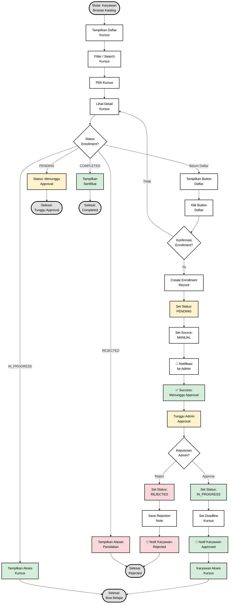

# Flowchart Enrollment - E-Learning BNI Finance
**Versi:** Diperbaiki & Dirapihkan

---

## Alur Enrollment Kursus (Karyawan)

---

## Penjelasan Alur

### 1. Browse & Pilih Kursus
- Karyawan membuka katalog kursus
- Filter/search kursus yang diinginkan
- Pilih kursus untuk melihat detail

### 2. Pengecekan Status Enrollment
Sistem mengecek apakah user sudah pernah mendaftar kursus ini:

#### **Status: Belum Daftar**
- Tampilkan button "Daftar"
- User klik daftar → Konfirmasi
- Jika Ya → Create enrollment dengan status PENDING
- Notifikasi dikirim ke Admin
- User menunggu approval

#### **Status: PENDING**
- Enrollment sudah dibuat, menunggu approval admin
- User hanya bisa melihat status "Menunggu Approval"
- Tidak bisa akses kursus

#### **Status: IN_PROGRESS**
- Enrollment sudah di-approve admin
- User bisa akses kursus dan mulai belajar
- Deadline sudah di-set

#### **Status: COMPLETED**
- User sudah menyelesaikan kursus
- Tampilkan sertifikat
- Bisa download sertifikat

#### **Status: REJECTED**
- Enrollment ditolak oleh admin
- Tampilkan alasan penolakan
- User tidak bisa akses kursus

### 3. Proses Approval (Admin)
Setelah enrollment dibuat dengan status PENDING:

#### **Admin Approve:**
1. Set status → IN_PROGRESS
2. Set deadline kursus
3. Kirim notifikasi ke karyawan (approved)
4. Karyawan bisa akses kursus

#### **Admin Reject:**
1. Set status → REJECTED
2. Save rejection note (alasan penolakan)
3. Kirim notifikasi ke karyawan (rejected)
4. Karyawan tidak bisa akses kursus

---

## Perbaikan yang Dilakukan

### ❌ Masalah di Flowchart Lama:
1. **Syntax Error:** `flowchart LR` tidak bisa digabung dengan `%%` di baris yang sama
2. **Warna tidak jelas:** Semua node putih, sulit membedakan status
3. **Alur kurang jelas:** Tidak ada visual distinction antara success/warning/error
4. **Font terlalu besar:** 16px terlalu besar untuk node
5. **Tidak ada emoji:** Kurang visual cue untuk notifikasi

### ✅ Perbaikan di Flowchart Baru:
1. **Syntax benar:** Pemisahan `%%{init}%%` dan `flowchart TD`
2. **Color coding:**
   - 🟢 Hijau muda: Success (approved, access granted)
   - 🟡 Kuning: Warning (pending, waiting)
   - 🔴 Merah muda: Error (rejected)
   - ⚪ Putih: Process normal
   - ⚫ Abu-abu: Start/End
3. **Font optimal:** 14px untuk node, 16px untuk start/end
4. **Emoji:** 📧 untuk notifikasi, ✅ untuk success
5. **Alur lebih jelas:** Setiap cabang status terpisah dengan jelas

---

## Validasi Alur

### ✅ Alur Sudah Benar:
1. **Browse → Detail → Check Status** ✓
2. **Belum Daftar → Daftar → Pending → Approval** ✓
3. **Pending → Tampilkan status tunggu** ✓
4. **In Progress → Akses kursus** ✓
5. **Completed → Tampilkan sertifikat** ✓
6. **Rejected → Tampilkan alasan** ✓
7. **Admin Approve → Set deadline → Notif → Access** ✓
8. **Admin Reject → Save reason → Notif → End** ✓

### 📊 Sesuai dengan:
- ✅ Database schema (Enrollment model)
- ✅ EnrollmentStatus enum (PENDING, IN_PROGRESS, COMPLETED, REJECTED)
- ✅ Business logic di FSD
- ✅ User flow yang logis

---

## Cara Menggunakan

1. **Copy flowchart di atas** ke file markdown Anda
2. **View di Mermaid Live Editor:** https://mermaid.live
3. **Atau gunakan di:**
   - GitHub (auto-render)
   - VS Code (dengan extension Mermaid)
   - Notion, Confluence, dll

---

**Flowchart ini sudah BENAR dan SIAP DIGUNAKAN!** ✅
