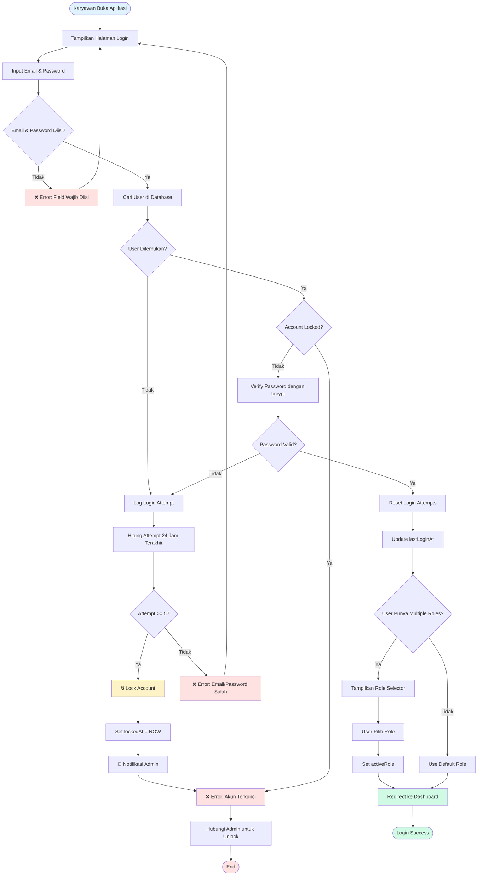
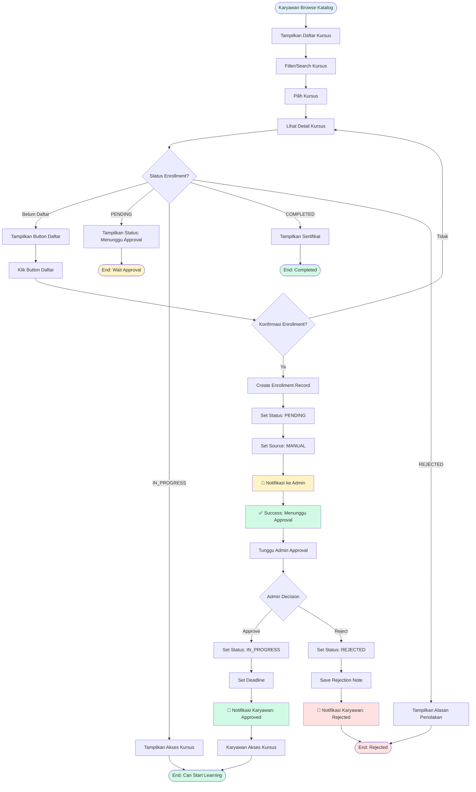

# Functional Specification Design (FSD)

**Document ID:** BNIF/IT/FSD/ELEARNING/V.01

---

# Functional Specification Design (FSD)

**Document ID:** BNIF/IT/FSD/ELEARNING/V.01

---

**[BNIF/IT/ELEARNING/2026/00001]**

**[E-LEARNING MANAGEMENT SYSTEM - LEARNING & DEVELOPMENT PLATFORM]**

---

**Date:** 11 Mei 2026  
**Prepared by:** IT Development Team

---

## Revision History

| Version No. | Description of Changes | Date of Revision | Prepared by | Sign-off |
|-------------|------------------------|------------------|-------------|----------|
| 0.1 | Draft Initial E-Learning System | 11 Mei 2026 | IT Development Team | |
| 1.0 | Complete FSD E-Learning System | 11 Mei 2026 | IT Development Team | |

---

## User Validation & Approval

| No | Employee Name | Position | Dept. / Division | Comment | Sign-off |
|----|---------------|----------|------------------|---------|----------|
| 1 | | Department Head | Human Capital | | |
| 2 | | Department Head | IT Development | | |
| 3 | | Division Head | Learning & Development | | |
| 4 | | IT Manager | IT Development | | |

---

## Table of Contents

1. [Latar Belakang (Background)](#1-latar-belakang-background)
2. [Ruang Lingkup (Scope)](#2-ruang-lingkup-scope)
3. [Alur Proses Bisnis (Business Process Flow)](#3-alur-proses-bisnis-business-process-flow)
4. [Kebutuhan Fungsional (Functional Requirements)](#4-kebutuhan-fungsional-functional-requirements)
5. [Struktur Database & Tabel](#5-struktur-database--tabel)
6. [Integrasi Sistem](#6-integrasi-sistem)
7. [Job Scheduler](#7-job-scheduler)
8. [Notifikasi & Reminder, Things to do](#8-notifikasi--reminder-things-to-do)
9. [Service Level Agreement (SLA)](#9-service-level-agreement-sla)
10. [Mock-up & User Interface (UI)](#10-mock-up--user-interface-ui)
11. [Report](#11-report)
12. [User Access Matrix](#12-user-access-matrix)
13. [Effort & Timeline](#13-effort--timeline)
14. [Limitation, Risk, & Constraint](#14-limitation-risk--constraint)

---

## 1. Latar Belakang (Background)

### 1.1 Kondisi Saat Ini

- BNI Finance memiliki kebutuhan untuk meningkatkan kompetensi karyawan melalui program pelatihan dan pengembangan yang terstruktur
- Proses pelatihan saat ini masih dilakukan secara manual dan tidak terintegrasi
- Tidak ada sistem terpusat untuk tracking progress pembelajaran karyawan
- Kesulitan dalam monitoring dan evaluasi efektivitas program pelatihan
- Tidak ada mekanisme reminder otomatis untuk deadline pelatihan
- Proses approval enrollment pelatihan masih manual dan memakan waktu

### 1.2 Permasalahan yang Dihadapi

- **Efisiensi Rendah:** Proses manual membutuhkan waktu lama dan rentan human error
- **Monitoring Sulit:** Tidak ada visibility real-time terhadap progress pembelajaran karyawan
- **Compliance Risk:** Kesulitan memastikan karyawan menyelesaikan pelatihan wajib tepat waktu
- **Data Tersebar:** Informasi pelatihan tidak terpusat dan sulit diakses
- **Reporting Manual:** Pembuatan laporan pelatihan memakan waktu dan tidak real-time

### 1.3 Solusi yang Diusulkan

Pengembangan **E-Learning Management System (LMS)** yang menyediakan:

- Platform terpusat untuk manajemen kursus dan materi pembelajaran
- Sistem enrollment dengan approval workflow
- Tracking progress pembelajaran secara real-time
- Assessment system dengan pre-test dan post-test
- Automated reminder dan deadline monitoring
- Dashboard analytics untuk monitoring dan reporting
- Multi-role access control (Admin, Karyawan, Super Admin)
- Auto-enrollment berdasarkan department
- Certificate generation otomatis

### 1.4 Manfaat yang Diharapkan

- **Efisiensi Operasional:** Otomasi proses enrollment, reminder, dan reporting
- **Visibility:** Real-time monitoring progress pembelajaran karyawan
- **Compliance:** Memastikan karyawan menyelesaikan pelatihan wajib tepat waktu
- **Data Centralized:** Semua data pelatihan tersimpan terpusat dan mudah diakses
- **Analytics:** Insight untuk evaluasi efektivitas program pelatihan
- **User Experience:** Interface modern dan user-friendly
- **Scalability:** Sistem dapat menampung pertumbuhan jumlah karyawan dan kursus

---

## 2. Ruang Lingkup (Scope)

### 2.1 In Scope

#### 2.1.1 User Management
- Multi-role system (Admin, Karyawan, Super Admin)
- Authentication (Email/Password, Microsoft SSO)
- Account locking mechanism (5 failed login attempts)
- Profile management
- Permission-based access control (RBAC)

#### 2.1.2 Course Management
- Course creation dengan wizard (4 steps)
- Module management (Video & PDF support)
- Category management (required untuk setiap course)
- Course publishing workflow
- Deadline configuration (fixed date atau duration)
- Lock after deadline feature
- Grace period configuration
- Course visibility control

#### 2.1.3 Learning & Progress Tracking
- Course enrollment dengan approval workflow
- Module completion tracking
- Video progress tracking (≥95% untuk complete)
- PDF progress tracking (≥90% untuk complete)
- Overall course progress calculation
- Bookmark & resume learning

#### 2.1.4 Assessment System
- Pre-test dan Post-test
- Multiple choice questions
- Question & option randomization
- Auto-grading system
- Passing score configuration
- Max attempts configuration
- Time limit per test
- Cheating detection & monitoring

#### 2.1.5 Enrollment Management
- Manual enrollment oleh karyawan
- Auto-enrollment berdasarkan department
- Approval workflow (Admin approve/reject)
- Deadline assignment
- Status tracking (PENDING, IN_PROGRESS, COMPLETED, FAILED, REJECTED)

#### 2.1.6 Notification System
- In-app notifications
- Email notifications
- Notification types:
  - Enrollment confirmation
  - Approval/rejection notification
  - Deadline reminders (7d, 3d, 1d before)
  - Escalation to department head
  - Course completion notification

#### 2.1.7 Analytics & Reporting
- Admin dashboard dengan KPI metrics
- Karyawan dashboard dengan personal progress
- Course completion reports
- Test score reports
- Leaderboard
- Department-wise analytics
- Export to Excel/PDF

#### 2.1.8 Certificate Management
- Auto certificate generation upon course completion
- Certificate template
- Certificate verification
- Download certificate (PDF)

#### 2.1.9 Scheduler Jobs
- Deadline monitoring (daily)
- Reminder notifications (daily)
- Auto-enrollment processing (daily)
- Analytics data aggregation (daily)
- Database backup (daily)

### 2.2 Out of Scope

- Live video conferencing / webinar
- Payment gateway integration
- Mobile native application (iOS/Android)
- Gamification features (badges, points)
- Social learning features (discussion forum, chat)
- Content authoring tools (built-in video editor, PDF editor)
- Integration dengan HR system lain (payroll, attendance)
- Multi-language support (hanya Bahasa Indonesia)
- Offline mode / download course untuk offline viewing

---

## 3. Alur Proses Bisnis (Business Process Flow)

### 3.1 Login Flow

### 3.2 Enrollment Flow

