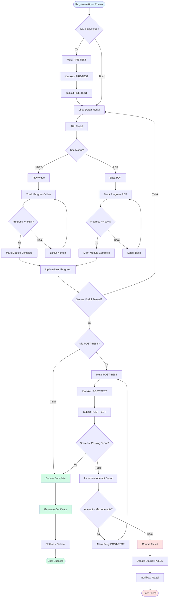

# FSD E-Learning BNI Finance - Part 2
**Lanjutan dari:** FSD_ELEARNING_BNIF.md

---

## 3.3 Learning Flow (Mengerjakan Kursus)

---

## 4. Kebutuhan Fungsional (Functional Requirements)

### 4.1 User Management

#### 4.1.1 Authentication
- **Login dengan Email/Password**
  - Input: Email, Password
  - Validasi: Email format, Password min 8 karakter
  - Hash password menggunakan bcrypt
  - Session management dengan NextAuth.js
  
- **Login dengan Microsoft SSO**
  - OAuth 2.0 integration
  - Auto-create user jika belum ada
  - Sync email dan nama dari Microsoft account

- **Account Locking**
  - Track failed login attempts (table: LoginAttempt)
  - Lock account setelah 5 failed attempts dalam 24 jam
  - Set lockedAt timestamp
  - Notifikasi ke admin
  - Admin dapat unlock account

#### 4.1.2 Multi-Role System
- **Roles:**
  - KARYAWAN: Akses learning, view own progress
  - ADMIN: Manage courses, approve enrollments, view reports
  - SUPER_ADMIN: Full access + permission management

- **Role Selection:**
  - User dengan multiple roles pilih active role saat login
  - Switch role tanpa logout
  - Permission check berdasarkan active role

#### 4.1.3 Profile Management
- View/edit profile (nama, email, department, lokasi, NIP)
- Change password
- View login history
- View notification preferences

### 4.2 Course Management

#### 4.2.1 Course Creation (Admin)
- **Step 1: Identitas**
  - Judul (required)
  - Deskripsi (optional)
  - Kategori (required - dropdown dari master category)
  - Thumbnail image (optional - upload)

- **Step 2: Kurikulum**
  - Tambah modul (VIDEO atau PDF)
  - Upload file (max 500MB untuk video, 50MB untuk PDF)
  - Set module order/position
  - Publish/unpublish module
  - Tambah PRE-TEST (optional)
  - Tambah POST-TEST (required untuk completion)

- **Step 3: Pengaturan**
  - Deadline type: Fixed date, Duration (days), atau No deadline
  - Lock after deadline (boolean)
  - Grace period (days - optional)
  - Visibility (public/private)

- **Step 4: Review & Publish**
  - Validasi kelengkapan course
  - Preview course
  - Publish course

#### 4.2.2 Module Management
- **Video Module:**
  - Upload video file (MP4, WebM, AVI)
  - Auto-detect duration
  - Store file size
  - Generate thumbnail (optional)
  - Support resume playback

- **PDF Module:**
  - Upload PDF file
  - Auto-detect page count
  - Store file size
  - Support bookmark page

#### 4.2.3 Test Management
- **Create Test:**
  - Title
  - Type (PRE atau POST)
  - Duration (minutes)
  - Passing score (%)
  - Max attempts (0 = unlimited)
  - Randomize questions (boolean)
  - Randomize options (boolean)

- **Add Questions:**
  - Question text (required)
  - Multiple options (min 2, max 6)
  - Mark correct answer
  - Support rich text (optional)

### 4.3 Learning & Progress Tracking

#### 4.3.1 Course Enrollment
- **Manual Enrollment:**
  - Karyawan browse catalog
  - Click Daftar button
  - Create enrollment dengan status PENDING
  - Notifikasi ke admin

- **Auto Enrollment:**
  - Admin create auto-enrollment rule
  - Set department
  - Set bypass approval (boolean)
  - Cron job process daily
  - Auto-create enrollment untuk matching users

#### 4.3.2 Progress Tracking
- **Video Progress:**
  - Track currentTime dan duration
  - Calculate completionRate (%)
  - Mark completed jika >= 95%
  - Track watchCount dan totalWatchTime
  - Update lastWatched timestamp

- **PDF Progress:**
  - Track currentPage dan totalPages
  - Track pagesViewed (array)
  - Track scrollPosition per page
  - Calculate completionRate (%)
  - Mark completed jika >= 90%
  - Track readCount dan totalReadTime

- **Overall Course Progress:**
  - Calculate: (completed modules / total modules) * 100
  - Update real-time
  - Display progress bar

### 4.4 Assessment System

#### 4.4.1 Test Execution
- Load test configuration
- Randomize questions (if enabled)
- Randomize options (if enabled)
- Start timer
- Enable cheating monitoring
- Save answers real-time
- Submit test (manual atau auto saat timer habis)

#### 4.4.2 Cheating Detection
- **Monitor Events:**
  - Tab switch (visibilitychange)
  - Window blur (focus loss)
  - Copy/paste attempts
  - DevTools open
  - Right-click disabled

- **Violation Handling:**
  - Log setiap violation
  - Increment violation count
  - Show warning ke user
  - Force submit jika > limit (default: 3)
  - Flag test as cheated
  - Set status: FORCE_SUBMITTED

#### 4.4.3 Auto-Grading
- Calculate score: (correct answers / total questions) * 100
- Compare dengan passing score
- Set passed = true/false
- Save test result
- Update enrollment status (untuk POST-TEST)

### 4.5 Notification System

#### 4.5.1 In-App Notifications
- Display di notification bell icon
- Badge count untuk unread
- Mark as read
- Link ke related page
- Auto-refresh

#### 4.5.2 Email Notifications
- **Templates:**
  - Enrollment confirmation
  - Approval notification
  - Rejection notification
  - Deadline reminder (7d, 3d, 1d)
  - Escalation to head
  - Course completion
  - Certificate ready

- **Email Service:**
  - SMTP configuration
  - Queue system untuk bulk email
  - Retry mechanism
  - Track delivery status

### 4.6 Analytics & Reporting

#### 4.6.1 Admin Dashboard
- **KPI Metrics:**
  - Total courses
  - Total enrollments
  - Completion rate
  - Average test score
  - Active learners

- **Charts:**
  - Enrollment trend (line chart)
  - Completion by department (bar chart)
  - Test score distribution (histogram)
  - Top courses (leaderboard)

#### 4.6.2 Karyawan Dashboard
- **Personal Metrics:**
  - Enrolled courses
  - In-progress courses
  - Completed courses
  - Certificates earned
  - Average score

- **Upcoming Deadlines:**
  - List courses dengan deadline
  - Sort by nearest deadline
  - Show days remaining
  - Alert jika overdue

---

## 5. Struktur Database & Tabel

### 5.1 Informasi Database

| Item | Value |
|------|-------|
| **Jenis Database Management** | PostgreSQL |
| **Versi Database** | PostgreSQL 15 |
| **Nama Database** | elearning_bnif |
| **Lokasi Hosting** | AWS Cloud Hosting |
| **Host Name** | AWS RDS |
| **Schema** | public |
| **ORM** | Prisma |

### 5.2 Entity Relationship Diagram (ERD)

**Lihat file:** docs/01_ERD_SISTEM.md untuk ERD lengkap dengan Mermaid diagram.

**Summary Entities:**
- User (17 fields)
- Course (15 fields)
- Category (2 fields)
- Module (16 fields)
- Test (10 fields)
- Question (4 fields)
- Option (5 fields)
- Enrollment (21 fields)
- UserProgress (5 fields)
- VideoProgress (13 fields)
- PDFProgress (14 fields)
- TestAttempt (17 fields)
- TestAnswer (5 fields)
- TestSession (11 fields)
- Notification (7 fields)
- AutoEnrollmentRule (7 fields)
- Permission (5 fields)
- RolePermission (3 fields)
- DepartmentConfig (6 fields)
- SchedulerLog (7 fields)
- LoginAttempt (3 fields)

**Total:** 21 Models, 197 Fields

### 5.3 Struktur Tabel Utama

#### 5.3.1 Table: User

| No | Column Name | Data Type | Nullable | Description |
|----|-------------|-----------|----------|-------------|
| 1 | id | String | FALSE | Primary Key (cuid) |
| 2 | name | String | TRUE | Display name |
| 3 | email | String | TRUE | Unique - Login identifier |
| 4 | emailVerified | DateTime | TRUE | Email verification timestamp |
| 5 | image | String | TRUE | Profile picture URL |
| 6 | password | String | TRUE | Hashed with bcrypt |
| 7 | role | UserRole | FALSE | Legacy - Default: KARYAWAN |
| 8 | roles | UserRole[] | FALSE | Multi-role - Default: [KARYAWAN] |
| 9 | activeRole | UserRole | TRUE | Currently active role |
| 10 | createdAt | DateTime | FALSE | Auto - Default: now() |
| 11 | updatedAt | DateTime | FALSE | Auto - Updated on change |
| 12 | department | String | TRUE | For auto-enrollment |
| 13 | lokasi | String | TRUE | Office location |
| 14 | nip | String | TRUE | Unique - Employee ID |
| 15 | authMethod | AuthMethod | FALSE | Default: MANUAL |
| 16 | lastLoginAt | DateTime | TRUE | Last successful login |
| 17 | lastLoginMethod | AuthMethod | TRUE | Method used in last login |
| 18 | lockedAt | DateTime | TRUE | NULL if not locked |

**Indexes:**
- email (UNIQUE)
- nip (UNIQUE)

**Relations:**
- enrollments  Enrollment[] (1:N)
- notifications  Notification[] (1:N)
- testAttempts  TestAttempt[] (1:N)
- userProgress  UserProgress[] (1:N)
- videoProgress  VideoProgress[] (1:N)
- pdfProgress  PDFProgress[] (1:N)

#### 5.3.2 Table: Course

| No | Column Name | Data Type | Nullable | Description |
|----|-------------|-----------|----------|-------------|
| 1 | id | String | FALSE | Primary Key (cuid) |
| 2 | userId | String | FALSE | Creator (Admin/Super Admin) |
| 3 | title | String | FALSE | Course name |
| 4 | description | String | TRUE | Course description |
| 5 | imageUrl | String | TRUE | Course thumbnail |
| 6 | isPublished | Boolean | FALSE | Default: false |
| 7 | categoryId | String | FALSE | REQUIRED - Cannot be NULL |
| 8 | deadlineDuration | Int | TRUE | Duration in days |
| 9 | deadlineDate | DateTime | TRUE | Fixed deadline date |
| 10 | lockAfterDeadline | Boolean | FALSE | Default: false |
| 11 | gracePeriodDays | Int | TRUE | Extra days after deadline |
| 12 | createdAt | DateTime | FALSE | Auto - Default: now() |
| 13 | updatedAt | DateTime | FALSE | Auto - Updated on change |
| 14 | isVisible | Boolean | FALSE | Default: true |

**Indexes:**
- categoryId (INDEX)

**Relations:**
- category  Category (N:1)
- modules  Module[] (1:N)
- tests  Test[] (1:N)
- enrollments  Enrollment[] (1:N)
- autoEnrollRules  AutoEnrollmentRule[] (1:N)

#### 5.3.3 Table: Enrollment

| No | Column Name | Data Type | Nullable | Description |
|----|-------------|-----------|----------|-------------|
| 1 | id | String | FALSE | Primary Key (cuid) |
| 2 | userId | String | FALSE | Foreign Key  User |
| 3 | courseId | String | FALSE | Foreign Key  Course |
| 4 | createdAt | DateTime | FALSE | Auto - Default: now() |
| 5 | updatedAt | DateTime | FALSE | Auto - Updated on change |
| 6 | status | EnrollmentStatus | FALSE | Default: PENDING |
| 7 | deadline | DateTime | TRUE | Deadline for completion |
| 8 | reportedAt | DateTime | TRUE | When reported to head |
| 9 | source | String | FALSE | Default: MANUAL |
| 10 | remindedAt7d | DateTime | TRUE | Reminded 7 days before |
| 11 | remindedAt3d | DateTime | TRUE | Reminded 3 days before |
| 12 | remindedAt1d | DateTime | TRUE | Reminded 1 day before |
| 13 | escalatedAt | DateTime | TRUE | Escalated to head |
| 14 | approvedAt | DateTime | TRUE | When approved |
| 15 | approvedById | String | TRUE | Admin who approved |
| 16 | rejectionNote | String | TRUE | Reason for rejection |
| 17 | postTestAttempts | Int | FALSE | Default: 0 |
| 18 | maxPostTestAttempts | Int | FALSE | Default: 3 |

**Indexes:**
- userId, courseId (UNIQUE)
- status (INDEX)
- courseId (INDEX)

**Enum: EnrollmentStatus**
- PENDING
- IN_PROGRESS
- COMPLETED
- FAILED
- REJECTED

#### 5.3.4 Table: TestAttempt

| No | Column Name | Data Type | Nullable | Description |
|----|-------------|-----------|----------|-------------|
| 1 | id | String | FALSE | Primary Key (cuid) |
| 2 | userId | String | FALSE | Foreign Key  User |
| 3 | testId | String | FALSE | Foreign Key  Test |
| 4 | enrollmentId | String | TRUE | Link to enrollment |
| 5 | attemptNumber | Int | FALSE | Default: 1 |
| 6 | score | Float | TRUE | Final score |
| 7 | passed | Boolean | FALSE | Default: false |
| 8 | createdAt | DateTime | FALSE | Auto - Default: now() |
| 9 | updatedAt | DateTime | FALSE | Auto - Updated on change |
| 10 | completedAt | DateTime | TRUE | When test was completed |
| 11 | startedAt | DateTime | TRUE | When test was started |
| 12 | status | TestAttemptStatus | FALSE | Default: ONGOING |
| 13 | timeSpent | Int | FALSE | Default: 0 (seconds) |

**Indexes:**
- userId (INDEX)
- testId (INDEX)
- enrollmentId (INDEX)
- attemptNumber (INDEX)

**Enum: TestAttemptStatus**
- ONGOING
- SUBMITTED
- FORCE_SUBMITTED

### 5.4 Stored Procedure & Function

Sistem ini menggunakan Prisma ORM, sehingga tidak ada stored procedure di database. Semua business logic ada di application layer (Next.js API Routes dan Server Actions).

---

## 6. Integrasi Sistem

### 6.1 Microsoft SSO Integration
- **Protocol:** OAuth 2.0
- **Provider:** Microsoft Azure AD
- **Library:** NextAuth.js dengan Microsoft Provider
- **Flow:**
  1. User click Login dengan Microsoft
  2. Redirect ke Microsoft login page
  3. User authenticate di Microsoft
  4. Microsoft return authorization code
  5. Exchange code untuk access token
  6. Fetch user profile dari Microsoft Graph API
  7. Create/update user di database
  8. Create session

### 6.2 Email Service Integration
- **SMTP Server:** Configurable (Gmail, SendGrid, AWS SES)
- **Library:** Nodemailer
- **Features:**
  - HTML email templates
  - Attachment support
  - Queue system untuk bulk email
  - Retry mechanism
  - Delivery tracking

### 6.3 File Storage
- **Primary:** Local file system (/private/uploads/)
- **Alternative:** SharePoint integration (optional)
- **Structure:**
  /private/uploads/
    /modules/
      /{timestamp}-{hash}-{filename}

### 6.4 Scheduler Integration
- **Library:** Node-cron atau Vercel Cron Jobs
- **Endpoint:** /api/cron/*
- **Authentication:** Secret token di header

---

## 7. Job Scheduler

### 7.1 Deadline Monitoring Job

**Schedule:** Setiap hari jam 08:00 WIB

**Endpoint:** GET /api/cron/deadline-monitoring

**Process:**
1. Fetch enrollments dengan status IN_PROGRESS
2. Loop setiap enrollment
3. Calculate days left to deadline
4. Send reminder berdasarkan threshold:
   - 7 days before  Send reminder, update remindedAt7d
   - 3 days before  Send reminder, update remindedAt3d
   - 1 day before  Send reminder, update remindedAt1d
   - Overdue  Escalate to department head, update escalatedAt
5. Lock course access jika lockAfterDeadline = true
6. Log job execution

**Notification Recipients:**
- Karyawan (email + in-app)
- Department head (untuk escalation)

### 7.2 Auto-Enrollment Job

**Schedule:** Setiap hari jam 01:00 WIB

**Endpoint:** GET /api/cron/auto-enroll

**Process:**
1. Fetch auto-enrollment rules dengan isActive = true
2. Loop setiap rule
3. Get course info
4. Fetch users by department
5. Loop setiap user
6. Check jika user belum enrolled
7. Create enrollment:
   - Jika bypassDeadline = true  Status: IN_PROGRESS
   - Jika bypassDeadline = false  Status: PENDING
8. Send notification
9. Log job execution

### 7.3 Reminder Notification Job

**Schedule:** Setiap hari jam 09:00 WIB

**Endpoint:** GET /api/cron/reminders

**Process:**
1. Fetch enrollments dengan deadline hari ini atau besok
2. Send reminder notification
3. Log job execution

### 7.4 Analytics Aggregation Job

**Schedule:** Setiap hari jam 02:00 WIB

**Endpoint:** GET /api/cron/analytics

**Process:**
1. Calculate daily metrics:
   - Total enrollments
   - Completion rate
   - Average test score
   - Active learners
2. Store aggregated data
3. Log job execution

### 7.5 Database Backup Job

**Schedule:** Setiap hari jam 03:00 WIB

**Script:** scripts/backup-database.sh

**Process:**
1. Create PostgreSQL dump
2. Compress file
3. Upload to backup storage (AWS S3)
4. Delete old backups (keep last 30 days)
5. Log backup status

---

## 8. Notifikasi & Reminder, Things to do

### 8.1 Enrollment Notifications

#### 8.1.1 Enrollment Confirmation (Karyawan)
**Trigger:** Setelah karyawan daftar kursus

**Recipient:** Karyawan yang mendaftar

**Channel:** Email + In-app

**Content:**
- Subject: Pendaftaran Kursus Berhasil
- Body: Informasi kursus, status PENDING, menunggu approval admin

#### 8.1.2 New Enrollment Alert (Admin)
**Trigger:** Setelah karyawan daftar kursus

**Recipient:** Admin

**Channel:** Email + In-app

**Content:**
- Subject: Pendaftaran Kursus Baru
- Body: Informasi karyawan, informasi kursus, link approval

#### 8.1.3 Enrollment Approved (Karyawan)
**Trigger:** Setelah admin approve enrollment

**Recipient:** Karyawan

**Channel:** Email + In-app

**Content:**
- Subject: Pendaftaran Kursus Disetujui
- Body: Informasi kursus, deadline, link akses kursus

#### 8.1.4 Enrollment Rejected (Karyawan)
**Trigger:** Setelah admin reject enrollment

**Recipient:** Karyawan

**Channel:** Email + In-app

**Content:**
- Subject: Pendaftaran Kursus Ditolak
- Body: Informasi kursus, alasan penolakan

### 8.2 Deadline Reminders

#### 8.2.1 Reminder 7 Days Before
**Trigger:** 7 hari sebelum deadline

**Recipient:** Karyawan

**Channel:** Email + In-app

**Content:**
- Subject: Reminder: 7 Hari Lagi Deadline Kursus
- Body: Informasi kursus, deadline, progress saat ini, link kursus

#### 8.2.2 Reminder 3 Days Before
**Trigger:** 3 hari sebelum deadline

**Recipient:** Karyawan

**Channel:** Email + In-app

**Content:**
- Subject: Reminder: 3 Hari Lagi Deadline Kursus
- Body: Informasi kursus, deadline, progress saat ini, link kursus

#### 8.2.3 Reminder 1 Day Before
**Trigger:** 1 hari sebelum deadline

**Recipient:** Karyawan

**Channel:** Email + In-app

**Content:**
- Subject: Reminder: Besok Deadline Kursus
- Body: Informasi kursus, deadline, progress saat ini, link kursus

#### 8.2.4 Overdue Escalation
**Trigger:** Setelah deadline terlewat

**Recipient:** Department Head + Karyawan

**Channel:** Email + In-app

**Content:**
- Subject: Escalation: Kursus Overdue
- Body: Informasi karyawan, informasi kursus, deadline, progress saat ini

### 8.3 Course Completion Notifications

#### 8.3.1 Course Completed (Karyawan)
**Trigger:** Setelah karyawan menyelesaikan kursus

**Recipient:** Karyawan

**Channel:** Email + In-app

**Content:**
- Subject: Selamat! Kursus Selesai
- Body: Informasi kursus, final score, link download certificate

#### 8.3.2 Certificate Ready (Karyawan)
**Trigger:** Setelah certificate di-generate

**Recipient:** Karyawan

**Channel:** Email + In-app

**Content:**
- Subject: Sertifikat Anda Sudah Siap
- Body: Informasi kursus, link download certificate

### 8.4 Test Notifications

#### 8.4.1 Test Failed (Karyawan)
**Trigger:** Setelah karyawan gagal test

**Recipient:** Karyawan

**Channel:** Email + In-app

**Content:**
- Subject: Test Tidak Lulus
- Body: Informasi test, score, passing score, remaining attempts

#### 8.4.2 Cheating Detected (Karyawan + Admin)
**Trigger:** Setelah cheating terdeteksi

**Recipient:** Karyawan + Admin

**Channel:** Email + In-app

**Content:**
- Subject: Peringatan: Kecurangan Terdeteksi
- Body: Informasi test, violation details, consequences

---

## 9. Service Level Agreement (SLA)

### 9.1 System Availability
- **Target:** 99.5% uptime
- **Downtime:** Max 3.6 jam/bulan
- **Maintenance Window:** Sabtu 02:00-06:00 WIB
- **Monitoring:** 24/7 dengan AWS CloudWatch

### 9.2 Performance
- **Page Load Time:** < 2 detik
- **API Response Time:** < 500ms
- **Video Streaming:** < 3 detik buffering
- **Database Query:** < 100ms (average)

### 9.3 Support Response Time
- **Critical Issues:** < 1 jam
- **High Priority:** < 4 jam (working hours)
- **Normal Priority:** < 24 jam
- **Low Priority:** < 72 jam

### 9.4 Resolution Time
- **Critical:** < 4 jam
- **High:** < 24 jam
- **Normal:** < 72 jam
- **Low:** < 1 minggu

### 9.5 Data Backup & Recovery
- **Backup Frequency:** Daily (03:00 WIB)
- **Backup Retention:** 30 days
- **Recovery Time Objective (RTO):** < 4 jam
- **Recovery Point Objective (RPO):** < 24 jam

### 9.6 Security
- **Security Audit:** Quarterly
- **Penetration Testing:** Bi-annually
- **Vulnerability Patching:** < 48 jam (critical), < 7 hari (normal)
- **SSL Certificate:** Always valid

---

## 10. Mock-up & User Interface (UI)

### 10.1 Login Page
**Features:**
- Email/Password form
- Login dengan Microsoft button
- Lupa Password link
- Remember me checkbox
- Responsive design (mobile-friendly)

**Elements:**
- BNI Finance logo
- Background image
- Form validation
- Error messages
- Loading state

### 10.2 Karyawan Dashboard
**Features:**
- Welcome banner dengan nama user
- KPI cards:
  - Total Enrolled Courses
  - In Progress Courses
  - Completed Courses
  - Certificates Earned
- Upcoming deadlines section
- Recent courses carousel
- Learning progress chart
- Quick access buttons

**Layout:**
- Header: Logo, Navigation, Notifications, Profile
- Sidebar: Menu (Dashboard, Courses, Calendar, Performance, Notifications)
- Main content: KPI + Charts + Lists
- Footer: Copyright, Links

### 10.3 Course Catalog
**Features:**
- Grid/List view toggle
- Filter by category (dropdown)
- Search bar (real-time search)
- Sort by (Newest, Popular, A-Z)
- Pagination
- Course cards:
  - Thumbnail image
  - Title
  - Description (truncated)
  - Category badge
  - Duration
  - Enroll button / Status badge

**Filters:**
- All Categories
- By Category
- Enrolled Only
- Completed Only

### 10.4 Course Detail Page
**Sections:**
- **Header:**
  - Course thumbnail
  - Title
  - Category
  - Description
  - Enroll button / Access button / Status badge
  
- **Course Info:**
  - Duration
  - Total modules
  - Tests (PRE/POST)
  - Deadline (if enrolled)
  - Progress bar (if enrolled)
  
- **Curriculum:**
  - Module list dengan icon (video/PDF)
  - Module duration
  - Completion checkmark
  - Lock icon (jika belum enrolled)
  
- **Tests:**
  - PRE-TEST info (if exists)
  - POST-TEST info
  - Passing score
  - Max attempts

### 10.5 Module Player (Video)
**Features:**
- Video player dengan controls:
  - Play/Pause
  - Volume
  - Fullscreen
  - Playback speed
  - Progress bar
- Module info sidebar:
  - Module title
  - Description
  - Duration
  - Progress percentage
- Navigation:
  - Previous module button
  - Next module button
  - Back to course button
- Progress tracking indicator
- Auto-save progress

### 10.6 Module Player (PDF)
**Features:**
- PDF viewer dengan controls:
  - Zoom in/out
  - Page navigation
  - Fullscreen
  - Download button
- Module info sidebar:
  - Module title
  - Description
  - Total pages
  - Progress percentage
- Navigation:
  - Previous module button
  - Next module button
  - Back to course button
- Progress tracking indicator
- Bookmark current page

### 10.7 Test Interface
**Features:**
- Test header:
  - Test title
  - Question counter (1/10)
  - Timer countdown
  - Submit button
- Question area:
  - Question number
  - Question text
  - Multiple choice options (radio buttons)
  - Mark for review checkbox
- Navigation:
  - Previous question
  - Next question
  - Question palette (grid)
- Warning banner (jika violation detected)
- Confirmation modal (before submit)

**States:**
- Answered (green)
- Not answered (gray)
- Marked for review (yellow)
- Current question (blue border)

### 10.8 Admin Dashboard
**Features:**
- KPI metrics cards:
  - Total Courses
  - Total Enrollments
  - Completion Rate
  - Average Test Score
  - Active Learners
- Charts:
  - Enrollment trend (line chart)
  - Completion by department (bar chart)
  - Test score distribution (histogram)
  - Top 10 courses (table)
- Recent enrollments table (pending approval)
- Quick actions:
  - Create Course
  - View All Enrollments
  - View Reports
  - Manage Users

### 10.9 Admin Course Management
**Features:**
- Course list table:
  - Thumbnail
  - Title
  - Category
  - Status (Published/Draft)
  - Total Enrollments
  - Completion Rate
  - Actions (Edit, Delete, Publish/Unpublish)
- Filters:
  - All / Published / Draft
  - By Category
  - Search
- Create Course button
- Bulk actions
- Export to Excel

### 10.10 Admin Enrollment Management
**Features:**
- Enrollment list table:
  - User name
  - NIP
  - Department
  - Course title
  - Status
  - Enrolled date
  - Deadline
  - Days remaining
  - Actions (Approve, Reject, View Details)
- Filters:
  - By Status (PENDING, IN_PROGRESS, COMPLETED, FAILED, REJECTED)
  - By Department
  - By Course
  - Date range
- Bulk approve/reject
- Export to Excel

### 10.11 Certificate Page
**Features:**
- Certificate preview (PDF)
- Download button
- Share button (optional)
- Certificate info:
  - Certificate number
  - Course name
  - Completion date
  - Final score
- Verification link

---

## 11. Report

### 11.1 Course Completion Report
**Data Columns:**
- Course Name
- Category
- Total Enrolled
- In Progress
- Completed
- Failed
- Completion Rate (%)
- Average Score

**Filters:**
- Date Range
- Category
- Department
- Status

**Export:** Excel, PDF

**Visualization:** Bar chart (Completion rate by course)

### 11.2 User Progress Report
**Data Columns:**
- User Name
- NIP
- Department
- Total Enrolled
- In Progress
- Completed
- Failed
- Completion Rate (%)
- Average Score
- Certificates Earned

**Filters:**
- Department
- Date Range
- Status

**Export:** Excel, PDF

**Visualization:** Pie chart (Status distribution)

### 11.3 Test Score Report
**Data Columns:**
- User Name
- NIP
- Department
- Course Name
- Test Type (PRE/POST)
- Score
- Passing Score
- Status (Pass/Fail)
- Attempt Number
- Test Date
- Time Spent

**Filters:**
- Course
- Test Type
- Date Range
- Pass/Fail
- Department

**Export:** Excel, PDF

**Visualization:** Histogram (Score distribution)

### 11.4 Enrollment Status Report
**Data Columns:**
- User Name
- NIP
- Department
- Course Name
- Status
- Enrolled Date
- Approved Date
- Deadline
- Days Remaining
- Progress (%)
- Approved By

**Filters:**
- Status
- Department
- Course
- Date Range

**Export:** Excel, PDF

**Visualization:** Stacked bar chart (Status by department)

### 11.5 Certificate Issuance Report
**Data Columns:**
- Certificate Number
- User Name
- NIP
- Department
- Course Name
- Completion Date
- Final Score
- Issued Date

**Filters:**
- Date Range
- Department
- Course

**Export:** Excel, PDF

**Visualization:** Line chart (Certificates issued over time)

### 11.6 Deadline Monitoring Report
**Data Columns:**
- User Name
- NIP
- Department
- Course Name
- Deadline
- Days Remaining
- Progress (%)
- Status
- Last Reminder Sent

**Filters:**
- Department
- Course
- Days Remaining (< 7, < 3, < 1, Overdue)

**Export:** Excel, PDF

**Visualization:** Gauge chart (On-time vs Overdue)

---

## 12. User Access Matrix

| Feature | KARYAWAN | ADMIN | SUPER_ADMIN |
|---------|----------|-------|-------------|
| **Authentication** |
| Login | ✅ | ✅ | ✅ |
| Logout | ✅ | ✅ | ✅ |
| Change Password | ✅ | ✅ | ✅ |
| **Course** |
| View Catalog | ✅ | ✅ | ✅ |
| View Course Detail | ✅ | ✅ | ✅ |
| Enroll Course | ✅ | ✅ | ✅ |
| Access Enrolled Course | ✅ | ✅ | ✅ |
| Create Course | ❌ | ✅ | ✅ |
| Edit Course | ❌ | ✅ | ✅ |
| Delete Course | ❌ | ❌ | ✅ |
| Publish/Unpublish Course | ❌ | ✅ | ✅ |
| **Module** |
| View Module | ✅ | ✅ | ✅ |
| Complete Module | ✅ | ✅ | ✅ |
| Create Module | ❌ | ✅ | ✅ |
| Edit Module | ❌ | ✅ | ✅ |
| Delete Module | ❌ | ❌ | ✅ |
| Upload Video/PDF | ❌ | ✅ | ✅ |
| **Test** |
| Take Test | ✅ | ✅ | ✅ |
| View Own Test Results | ✅ | ✅ | ✅ |
| Retry Test | ✅ | ✅ | ✅ |
| View All Test Results | ❌ | ✅ | ✅ |
| Create Test | ❌ | ✅ | ✅ |
| Edit Test | ❌ | ✅ | ✅ |
| Delete Test | ❌ | ❌ | ✅ |
| Add Questions | ❌ | ✅ | ✅ |
| **Enrollment** |
| View Own Enrollments | ✅ | ✅ | ✅ |
| View All Enrollments | ❌ | ✅ | ✅ |
| Approve Enrollment | ❌ | ✅ | ✅ |
| Reject Enrollment | ❌ | ✅ | ✅ |
| Cancel Enrollment | ✅ | ✅ | ✅ |
| **Progress** |
| View Own Progress | ✅ | ✅ | ✅ |
| View All Progress | ❌ | ✅ | ✅ |
| Track Video Progress | ✅ | ✅ | ✅ |
| Track PDF Progress | ✅ | ✅ | ✅ |
| **Certificate** |
| View Own Certificates | ✅ | ✅ | ✅ |
| Download Certificate | ✅ | ✅ | ✅ |
| View All Certificates | ❌ | ✅ | ✅ |
| **User Management** |
| View Own Profile | ✅ | ✅ | ✅ |
| Edit Own Profile | ✅ | ✅ | ✅ |
| View All Users | ❌ | ✅ | ✅ |
| Create User | ❌ | ❌ | ✅ |
| Edit User | ❌ | ❌ | ✅ |
| Delete User | ❌ | ❌ | ✅ |
| Lock/Unlock Account | ❌ | ✅ | ✅ |
| Assign Roles | ❌ | ❌ | ✅ |
| **Category** |
| View Categories | ✅ | ✅ | ✅ |
| Create Category | ❌ | ✅ | ✅ |
| Edit Category | ❌ | ✅ | ✅ |
| Delete Category | ❌ | ❌ | ✅ |
| **Permission** |
| View Permissions | ❌ | ❌ | ✅ |
| Manage Permissions | ❌ | ❌ | ✅ |
| Assign Permissions to Role | ❌ | ❌ | ✅ |
| **Reports** |
| View Own Reports | ✅ | ✅ | ✅ |
| View All Reports | ❌ | ✅ | ✅ |
| Export Reports | ❌ | ✅ | ✅ |
| **Analytics** |
| View Own Analytics | ✅ | ✅ | ✅ |
| View All Analytics | ❌ | ✅ | ✅ |
| View Dashboard | ✅ | ✅ | ✅ |
| **Notifications** |
| View Own Notifications | ✅ | ✅ | ✅ |
| Mark as Read | ✅ | ✅ | ✅ |
| Delete Notification | ✅ | ✅ | ✅ |
| **Auto-Enrollment** |
| View Rules | ❌ | ✅ | ✅ |
| Create Rule | ❌ | ✅ | ✅ |
| Edit Rule | ❌ | ✅ | ✅ |
| Delete Rule | ❌ | ❌ | ✅ |
| **Department Config** |
| View Config | ❌ | ✅ | ✅ |
| Create Config | ❌ | ❌ | ✅ |
| Edit Config | ❌ | ❌ | ✅ |
| Delete Config | ❌ | ❌ | ✅ |

---

## 13. Effort & Timeline

### 13.1 Effort Estimation

| No | Task | Effort (Mandays) | Resources |
|----|------|------------------|-----------|
| 1 | Requirement Gathering | 3 | BA, PM |
| 2 | Analysis & Design | 5 | SA, BA |
| 3 | Database Design | 3 | DB Designer |
| 4 | Backend Development | 20 | 2 Backend Devs |
| 5 | Frontend Development | 25 | 2 Frontend Devs |
| 6 | Integration (SSO, Email) | 5 | Backend Dev |
| 7 | Testing (Unit, Integration) | 10 | QA Team |
| 8 | User Acceptance Testing (UAT) | 10 | Users, QA |
| 9 | Documentation | 5 | Tech Writer |
| 10 | Deployment & Configuration | 3 | DevOps |
| 11 | Training | 3 | Trainer |
| 12 | Monitoring & Bug Fixing | 5 | Dev Team |
| **Total Effort** | **97 Mandays** | |

### 13.2 Project Timeline

| No | Phase | Task | Plan Start | Plan End | Duration (Days) |
|----|-------|------|------------|----------|-----------------|
| **1** | **Initiation** | | | | **3** |
| 1.1 | | Requirement Gathering | 01 Jun 2026 | 03 Jun 2026 | 3 |
| **2** | **Planning** | | | | **8** |
| 2.1 | | Analysis & Design | 04 Jun 2026 | 10 Jun 2026 | 5 |
| 2.2 | | Database Design | 11 Jun 2026 | 13 Jun 2026 | 3 |
| **3** | **Development** | | | | **30** |
| 3.1 | | Backend Development | 16 Jun 2026 | 11 Jul 2026 | 20 |
| 3.2 | | Frontend Development | 16 Jun 2026 | 18 Jul 2026 | 25 |
| 3.3 | | Integration | 21 Jul 2026 | 25 Jul 2026 | 5 |
| **4** | **Testing** | | | | **20** |
| 4.1 | | Unit & Integration Testing | 28 Jul 2026 | 08 Aug 2026 | 10 |
| 4.2 | | User Acceptance Testing | 11 Aug 2026 | 24 Aug 2026 | 10 |
| **5** | **Deployment** | | | | **11** |
| 5.1 | | Documentation | 25 Aug 2026 | 31 Aug 2026 | 5 |
| 5.2 | | Deployment & Configuration | 01 Sep 2026 | 03 Sep 2026 | 3 |
| 5.3 | | Training | 04 Sep 2026 | 08 Sep 2026 | 3 |
| **6** | **Go Live** | | | | **1** |
| 6.1 | | Go Live | 09 Sep 2026 | 09 Sep 2026 | 1 |
| **7** | **Post Go Live** | | | | **5** |
| 7.1 | | Monitoring & Bug Fixing | 10 Sep 2026 | 16 Sep 2026 | 5 |
| | | **Total Project Duration** | | | **~3.5 Bulan** |

### 13.3 Milestones

| Milestone | Target Date | Deliverables |
|-----------|-------------|--------------|
| **M1: Requirements Approved** | 03 Jun 2026 | FSD Document, BRD Document |
| **M2: Design Completed** | 13 Jun 2026 | ERD, Class Diagram, Flowchart, UI Mockups |
| **M3: Development Completed** | 25 Jul 2026 | Working Application (All Features) |
| **M4: Testing Completed** | 24 Aug 2026 | Test Report, Bug List (Resolved) |
| **M5: UAT Approved** | 24 Aug 2026 | UAT Sign-off Document |
| **M6: Deployment Completed** | 03 Sep 2026 | Production Environment Ready |
| **M7: Training Completed** | 08 Sep 2026 | Training Materials, User Guide |
| **M8: Go Live** | 09 Sep 2026 | System Live in Production |
| **M9: Project Closure** | 16 Sep 2026 | Project Closure Document |

---

## 14. Limitation, Risk, & Constraint

### 14.1 Limitation

#### 14.1.1 Technical Limitations

1. **File Size Limit**
   - Video: Max 500MB per file
   - PDF: Max 50MB per file
   - **Reason:** Server storage capacity dan bandwidth
   - **Impact:** Large files harus di-compress atau split

2. **Concurrent Users**
   - Max 500 concurrent users
   - **Reason:** Server capacity (AWS tier)
   - **Impact:** Performance degradation jika > 500 users
   - **Mitigation:** Upgrade server tier jika needed

3. **Browser Compatibility**
   - Support: Chrome 90+, Firefox 88+, Edge 90+, Safari 14+
   - Not support: IE 11, older browsers
   - **Reason:** Modern web technologies (ES6+, WebRTC)
   - **Impact:** Users dengan old browsers tidak bisa akses

4. **Video Format**
   - Support: MP4, WebM, AVI
   - Not support: MOV, FLV, WMV
   - **Reason:** Browser compatibility
   - **Impact:** Video harus di-convert dulu

5. **Language**
   - Hanya Bahasa Indonesia
   - **Reason:** Scope limitation
   - **Impact:** International users tidak bisa gunakan

#### 14.1.2 Functional Limitations

1. **Offline Mode**
   - Tidak support offline viewing
   - **Reason:** Complexity dan security
   - **Impact:** Users harus online untuk akses

2. **Mobile App**
   - Tidak ada native mobile app
   - Hanya responsive web
   - **Reason:** Budget dan timeline
   - **Impact:** Mobile experience tidak optimal

3. **Live Streaming**
   - Tidak support live video/webinar
   - Hanya pre-recorded video
   - **Reason:** Infrastructure complexity
   - **Impact:** Tidak bisa untuk live training

4. **Social Features**
   - Tidak ada discussion forum, chat
   - **Reason:** Scope limitation
   - **Impact:** Tidak ada peer interaction

### 14.2 Risk

#### 14.2.1 Technical Risks

| Risk | Probability | Impact | Mitigation |
|------|-------------|--------|------------|
| **Performance degradation saat peak usage** | Medium | High | Load testing, Caching, CDN, Auto-scaling |
| **Microsoft SSO integration failure** | Low | Medium | Fallback ke email/password, Extensive testing |
| **Data loss saat deployment** | Low | Critical | Backup before deployment, Rollback plan |
| **Security breach / Unauthorized access** | Low | Critical | RBAC, Encryption, Security audit, Penetration testing |
| **Video streaming buffering issues** | Medium | Medium | CDN, Video compression, Adaptive bitrate |

#### 14.2.2 Business Risks

| Risk | Probability | Impact | Mitigation |
|------|-------------|--------|------------|
| **Low user adoption** | Medium | High | Training, User guide, Support team, Change management |
| **Resistance to change** | Medium | Medium | Stakeholder engagement, Communication plan |
| **Incomplete requirements** | Low | High | Regular review meetings, Prototype validation |
| **Budget overrun** | Low | Medium | Strict scope control, Regular budget monitoring |
| **Timeline delay** | Medium | Medium | Buffer time, Prioritize MVP features, Agile approach |

#### 14.2.3 Operational Risks

| Risk | Probability | Impact | Mitigation |
|------|-------------|--------|------------|
| **Insufficient training** | Medium | Medium | Comprehensive training program, User guide, Video tutorials |
| **Lack of support resources** | Low | Medium | Dedicated support team, Knowledge base, FAQ |
| **Data migration issues** | Low | High | Data validation, Testing, Rollback plan |
| **Cheating bypass** | Medium | Medium | Multiple detection methods, Manual review, Continuous improvement |

### 14.3 Constraint

#### 14.3.1 Budget Constraint
- **Constraint:** Limited budget untuk infrastructure dan development
- **Impact:** 
  - Pilih AWS tier yang cost-effective
  - Limit concurrent users
  - Prioritize MVP features
- **Mitigation:** 
  - Phased implementation
  - Use open-source libraries
  - Optimize resource usage

#### 14.3.2 Timeline Constraint
- **Constraint:** Target go-live: 3.5 bulan
- **Impact:**
  - Limited time untuk development
  - Compressed testing phase
  - Risk of bugs in production
- **Mitigation:**
  - Agile methodology
  - Prioritize critical features
  - Parallel development tracks
  - Automated testing

#### 14.3.3 Resource Constraint
- **Constraint:** Limited developer resources (2 backend, 2 frontend)
- **Impact:**
  - Cannot develop all features simultaneously
  - Risk of burnout
  - Knowledge silos
- **Mitigation:**
  - Clear task prioritization
  - Code review untuk knowledge sharing
  - Outsource non-critical tasks
  - Pair programming

#### 14.3.4 Technical Constraint
- **Constraint:** Must use existing tech stack (Next.js, PostgreSQL, AWS)
- **Impact:**
  - No flexibility untuk tech choice
  - Must work within framework limitations
- **Mitigation:**
  - Leverage framework best practices
  - Use proven libraries
  - Consult documentation

#### 14.3.5 Compliance Constraint
- **Constraint:** Must comply dengan data privacy regulations
- **Impact:**
  - Additional security measures required
  - Data encryption overhead
  - Audit trail requirements
- **Mitigation:**
  - Security by design
  - Regular security audits
  - Compliance checklist

---

## Appendix

### A. Glossary

| Term | Definition |
|------|------------|
| **LMS** | Learning Management System - Platform untuk mengelola pembelajaran |
| **RBAC** | Role-Based Access Control - Kontrol akses berdasarkan role |
| **SSO** | Single Sign-On - Login sekali untuk akses multiple systems |
| **PRE-TEST** | Test yang dikerjakan sebelum mengikuti kursus |
| **POST-TEST** | Test yang dikerjakan setelah menyelesaikan semua modul |
| **Enrollment** | Pendaftaran kursus oleh karyawan |
| **Completion Rate** | Persentase modul yang diselesaikan dari total modul |
| **Passing Score** | Nilai minimum untuk lulus test |
| **Grace Period** | Waktu tambahan setelah deadline |
| **Escalation** | Pelaporan ke atasan (department head) |
| **Cheating Detection** | Sistem monitoring untuk mendeteksi kecurangan saat test |
| **Force Submit** | Submit otomatis saat cheating terdeteksi |
| **Auto-Enrollment** | Pendaftaran otomatis berdasarkan department |
| **Cron Job** | Scheduled task yang berjalan otomatis |
| **ORM** | Object-Relational Mapping - Prisma |
| **CDN** | Content Delivery Network |
| **RTO** | Recovery Time Objective |
| **RPO** | Recovery Point Objective |

### B. Reference Documents

1. **docs/01_ERD_SISTEM.md** - Entity Relationship Diagram
2. **docs/02_CLASS_DIAGRAM_SISTEM.md** - Class Diagram
3. **docs/03_FLOWCHART_SISTEM.md** - Flowchart
4. **prisma/schema.prisma** - Database Schema
5. **docs/00_PANDUAN_DOKUMENTASI.md** - Documentation Guide

### C. Technology Stack

| Layer | Technology | Version |
|-------|------------|---------|
| **Frontend** | Next.js | 14.x |
| | React | 18.x |
| | TypeScript | 5.x |
| | Tailwind CSS | 3.x |
| | Shadcn/UI | Latest |
| **Backend** | Next.js API Routes | 14.x |
| | Server Actions | Next.js 14 |
| **Database** | PostgreSQL | 15.x |
| **ORM** | Prisma | 5.x |
| **Authentication** | NextAuth.js | 4.x |
| **File Storage** | Local / SharePoint | - |
| **Email** | Nodemailer | Latest |
| **Deployment** | Docker | Latest |
| | AWS RDS | PostgreSQL 15 |
| | AWS S3 | - |
| | AWS ECS | - |
| **Monitoring** | AWS CloudWatch | - |
| **CI/CD** | GitHub Actions | - |

### D. Contact Information

| Role | Name | Email | Phone |
|------|------|-------|-------|
| **Project Manager** | - | - | - |
| **Business Analyst** | - | - | - |
| **System Analyst** | - | - | - |
| **Tech Lead** | - | - | - |
| **QA Lead** | - | - | - |
| **DevOps Engineer** | - | - | - |

---

## Document Approval

| Role | Name | Signature | Date |
|------|------|-----------|------|
| **Prepared by** | IT Development Team | | 11 Mei 2026 |
| **Reviewed by** | IT Manager | | |
| **Approved by** | Department Head IT | | |
| **Approved by** | Department Head HC | | |

---

**Document End**

**Document ID:** BNIF/IT/FSD/ELEARNING/V.01  
**Version:** 1.0  
**Status:** Final  
**Date:** 11 Mei 2026  

**© 2026 BNI Finance - E-Learning Management System**

---

**BNIF/IT Development/Functional Specification Document V.01**

---

## 9. Service Level Agreement (SLA)

### 9.1 System Availability
- **Target:** 99.5% uptime
- **Downtime:** Max 3.6 jam/bulan
- **Maintenance Window:** Sabtu 02:00-06:00 WIB
- **Monitoring:** 24/7 dengan AWS CloudWatch

### 9.2 Performance
- **Page Load Time:** < 2 detik
- **API Response Time:** < 500ms
- **Video Streaming:** < 3 detik buffering
- **Database Query:** < 100ms (average)

### 9.3 Support Response Time
- **Critical Issues:** < 1 jam
- **High Priority:** < 4 jam (working hours)
- **Normal Priority:** < 24 jam
- **Low Priority:** < 72 jam

### 9.4 Resolution Time
- **Critical:** < 4 jam
- **High:** < 24 jam
- **Normal:** < 72 jam
- **Low:** < 1 minggu

### 9.5 Data Backup & Recovery
- **Backup Frequency:** Daily (03:00 WIB)
- **Backup Retention:** 30 days
- **Recovery Time Objective (RTO):** < 4 jam
- **Recovery Point Objective (RPO):** < 24 jam

### 9.6 Security
- **Security Audit:** Quarterly
- **Penetration Testing:** Bi-annually
- **Vulnerability Patching:** < 48 jam (critical), < 7 hari (normal)
- **SSL Certificate:** Always valid

---

## 10. Mock-up & User Interface (UI)

### 10.1 Login Page
**Features:**
- Email/Password form
- Login dengan Microsoft button
- Lupa Password link
- Remember me checkbox
- Responsive design (mobile-friendly)

**Elements:**
- BNI Finance logo
- Background image
- Form validation
- Error messages
- Loading state

### 10.2 Karyawan Dashboard
**Features:**
- Welcome banner dengan nama user
- KPI cards: Total Enrolled, In Progress, Completed, Certificates
- Upcoming deadlines section
- Recent courses carousel
- Learning progress chart
- Quick access buttons

**Layout:**
- Header: Logo, Navigation, Notifications, Profile
- Sidebar: Menu (Dashboard, Courses, Calendar, Performance, Notifications)
- Main content: KPI + Charts + Lists
- Footer: Copyright, Links

### 10.3 Course Catalog
**Features:**
- Grid/List view toggle
- Filter by category
- Search bar (real-time)
- Sort by (Newest, Popular, A-Z)
- Pagination
- Course cards with thumbnail, title, description, category, duration

### 10.4 Course Detail Page
**Sections:**
- Header: Thumbnail, Title, Category, Description, Enroll button
- Course Info: Duration, Modules, Tests, Deadline, Progress
- Curriculum: Module list with icons, duration, completion status
- Tests: PRE/POST-TEST info, passing score, max attempts

### 10.5 Module Player (Video)
**Features:**
- Video player with controls (Play/Pause, Volume, Fullscreen, Speed)
- Module info sidebar
- Navigation buttons (Previous, Next, Back to course)
- Progress tracking indicator
- Auto-save progress

### 10.6 Module Player (PDF)
**Features:**
- PDF viewer with controls (Zoom, Page navigation, Fullscreen, Download)
- Module info sidebar
- Navigation buttons
- Progress tracking
- Bookmark current page

### 10.7 Test Interface
**Features:**
- Test header: Title, Question counter, Timer, Submit button
- Question area: Number, Text, Multiple choice options
- Navigation: Previous, Next, Question palette
- Warning banner (violation detected)
- Confirmation modal

### 10.8 Admin Dashboard
**Features:**
- KPI metrics cards
- Charts: Enrollment trend, Completion by dept, Score distribution
- Recent enrollments table
- Quick actions

### 10.9 Admin Course Management
**Features:**
- Course list table with filters
- Create Course button
- Actions: Edit, Delete, Publish/Unpublish
- Export to Excel

### 10.10 Admin Enrollment Management
**Features:**
- Enrollment list table
- Filters: Status, Department, Course, Date range
- Actions: Approve, Reject, View Details
- Bulk actions
- Export to Excel

### 10.11 Certificate Page
**Features:**
- Certificate preview (PDF)
- Download button
- Certificate info: Number, Course, Date, Score
- Verification link

